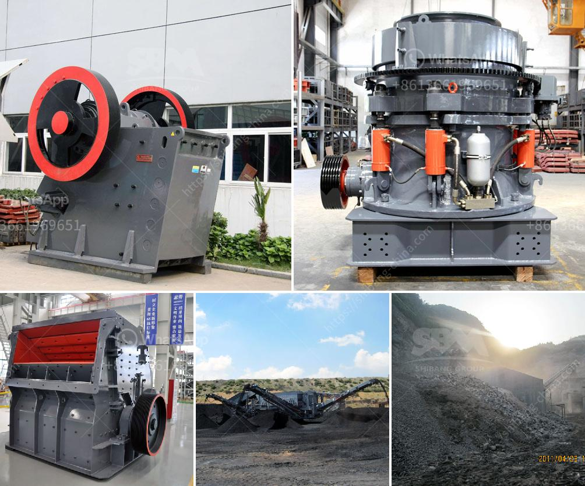

<h3>bentonite plant german</h3>
Germany has always been at the forefront of technological advancements, and the bentonite plant in German is no exception. Bentonite, a versatile clay mineral, has immense industrial applications, from oil drilling to pharmaceuticals. The German bentonite plant is a pioneering facility that uses cutting-edge technology to produce high-quality bentonite products efficiently.

The plant is equipped with state-of-the-art machinery and advanced techniques that ensure the production process is carried out seamlessly. From the initial mixing of raw materials to the final packaging, every step is meticulously monitored to maintain the highest standards of quality. The plant's automated systems guarantee consistency and uniformity, making German bentonite a preferred choice for various industries.

One of the plant's standout features is its commitment to sustainability. German bentonite production prioritizes environmentally-friendly techniques, reducing the plant's carbon footprint. Advanced waste management systems and efficient energy usage ensure that the production process is as eco-friendly as possible. The plant actively engages in recycling initiatives, making it a responsible player in the industry.

Furthermore, the German bentonite plant constantly seeks innovations to enhance their product range. With ongoing research and development, the plant aims to introduce new applications for bentonite, diversifying its market reach. This focus on innovation ensures that the plant remains ahead of the curve, meeting evolving industry demands.

The German bentonite plant also embraces a customer-centric approach. The facility provides excellent customer support, promptly addressing queries and concerns. The plant's commitment to customer satisfaction extends throughout the supply chain, ensuring timely delivery and competitive prices. This dedication has helped the German plant carve a niche in the market, gaining a reputation for reliability and trustworthiness.

In conclusion, the bentonite plant in Germany is a shining example of technological advancements and sustainability practices. By prioritizing quality, innovation, and customer satisfaction, the German plant continues to be an industry leader. With its state-of-the-art machinery, commitment to sustainability, and constant focus on research and development, the plant ensures that German bentonite remains a top choice for various applications worldwide.
<h3>Contact us</h3><ul><li><strong>Whatsapp:&nbsp;<a href="https://wa.me/8613661969651">+8613661969651</a></strong></li><li><a href="https://swt.shibang-china.com/?git&amp;zhl&amp;bentonite plant german"><strong>Online Service(chat now)</strong></a></li></ul><h3>Related</h3><ul><li><a href='supplier of crusher equipment in ghana.md'>supplier of crusher equipment in ghana</a></li><li><a href='german cement grinding unit operations.md'>german cement grinding unit operations</a></li><li><a href='used horizontal impact crusher hazemag.md'>used horizontal impact crusher hazemag</a></li><li><a href='crushing aggregates companies in philippines.md'>crushing aggregates companies in philippines</a></li><li><a href='pakistan coal crushing plant in peshawar.md'>pakistan coal crushing plant in peshawar</a></li></ul>