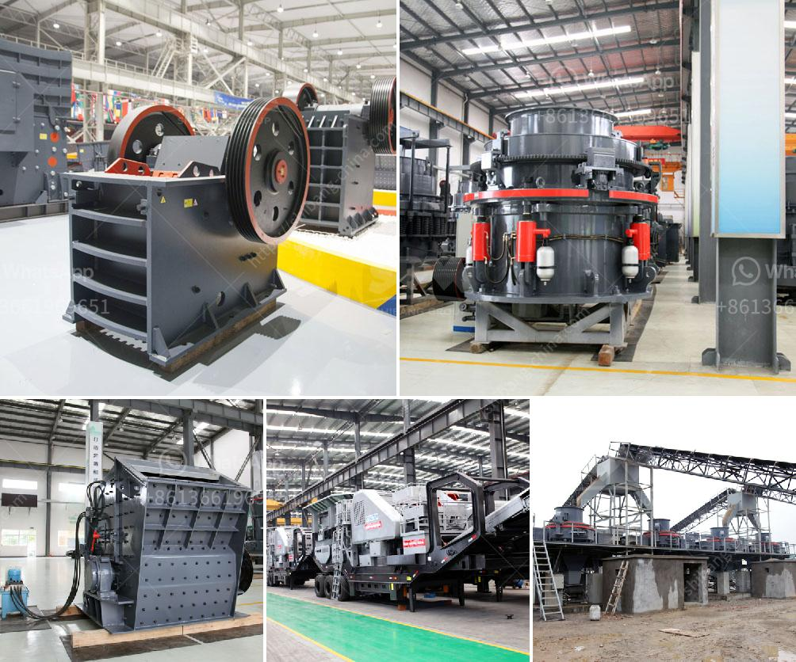

<h3>best mill for wet grinding of calcium carbonate</h3>
The calcium carbonate industry is growing rapidly, with a high demand for materials that require fine grinding. In order to meet this need, manufacturers have developed wet grinding mills that can efficiently grind large quantities of calcium carbonate into a fine powder.

One of the most popular wet grinding mills for calcium carbonate is the Alpine ANR vertical wet grinding mill. This mill has a compact design, allowing it to be easily integrated into existing systems. It also provides precise control over particle size distribution, ensuring that the final product meets the desired specifications.

The Alpine ANR mill is equipped with a grinding chamber where the grinding beads are accelerated by a rotating agitator. As the beads collide with the calcium carbonate particles, they break them down into smaller sizes. The smaller particles then pass through a classifier, which separates them according to their size. The larger particles are sent back to the grinding chamber for further processing.

One of the main advantages of the Alpine ANR mill is its ability to handle large quantities of calcium carbonate. It can process up to several tons of material per hour, allowing manufacturers to meet the demands of their customers quickly and efficiently.

Another advantage of the Alpine ANR mill is its ability to produce a high-quality product. The mill operates at low speeds, minimizing the generation of heat and ensuring that the final product remains cool. This reduces the risk of thermal degradation, preserving the properties of the calcium carbonate.

In conclusion, the Alpine ANR vertical wet grinding mill is one of the best mills available for wet grinding of calcium carbonate. It offers a compact design, precise control over particle size distribution, and the ability to handle large quantities of material. Its high-quality output makes it a popular choice among manufacturers in the calcium carbonate industry.
<h3>Contact us</h3><ul><li><strong>Whatsapp:&nbsp;<a href="https://wa.me/8613661969651">+8613661969651</a></strong></li><li><a href="https://swt.shibang-china.com/?git&amp;zhl&amp;best mill for wet grinding of calcium carbonate"><strong>Online Service(chat now)</strong></a></li></ul><h3>Related</h3><ul><li><a href='portable limestone jaw crusher for hire in south africa.md'>portable limestone jaw crusher for hire in south africa</a></li><li><a href='gyratory crusher prices.md'>gyratory crusher prices</a></li><li><a href='clinker making machine for sell germany.md'>clinker making machine for sell germany</a></li><li><a href='small aggregate washer plants.md'>small aggregate washer plants</a></li><li><a href='stone crusher machine in zimbabwe.md'>stone crusher machine in zimbabwe</a></li></ul>