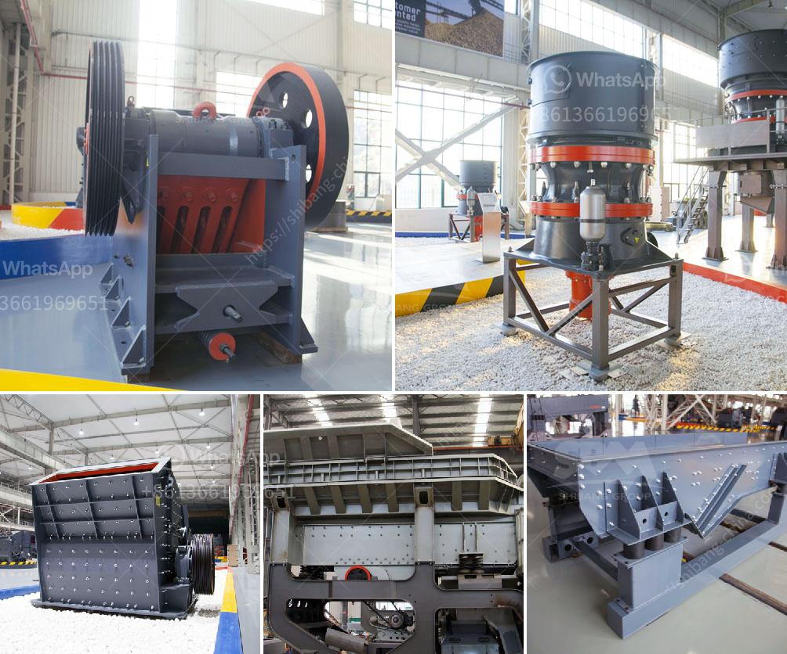

<h3>best mills for barite</h3>
When it comes to choosing the best mill for barite, there are several factors to consider. Barite is a mineral that is commonly used in various industries such as oil and gas drilling, paint and coating, and medical applications. To achieve the desired particle size and quality of the barite, selecting the appropriate mill is crucial. In this article, we will discuss some of the best mills available for processing barite.

One of the most commonly used mills for barite is Raymond mill. Raymond mill has a long history in the industry and has been widely used in barite grinding. With the development of technology, Raymond mill has evolved to become more advanced and efficient. It can grind barite particles down to a few microns, which is ideal for many applications. Additionally, the Raymond mill has a low energy consumption and is highly reliable, making it a popular choice among barite producers.

Another excellent mill for barite is the vertical roller mill (VRM). This mill is specifically designed for grinding minerals, including barite. It offers a compact design and can be easily installed in small spaces. The VRM has a high grinding efficiency and can produce finer particles compared to other mills. It is also known for its low maintenance requirements, which makes it a cost-effective choice for barite processing.

For larger scale barite production, a ball mill is often the preferred choice. A ball mill can grind and homogenize large volumes of barite particles efficiently. It offers a wide range of grinding media options and can be customized to suit the specific requirements of the barite producer. The ball mill is also known for its versatility and can be used in various other applications besides barite grinding.

In recent years, there has been an increasing interest in using ultrafine mills for barite processing. Ultrafine mills are capable of producing extremely fine particles, sometimes as small as a few nanometers. These mills use advanced grinding technologies to achieve the desired particle size distribution. While ultrafine milling is more expensive, it can provide superior quality and highly pure barite particles, making it suitable for high-end applications.

In conclusion, selecting the best mill for barite processing depends on various factors such as the desired particle size, production capacity, energy consumption, and cost-effectiveness. Raymond mill, vertical roller mill, ball mill, and ultrafine mill are among the best options available. Each mill has its own advantages and can be suitable for different production requirements. It is recommended to consult with an expert or a mill manufacturer to determine the most suitable mill for your specific needs.
<h3>Contact us</h3><ul><li><strong>Whatsapp:&nbsp;<a href="https://wa.me/8613661969651">+8613661969651</a></strong></li><li><a href="https://swt.shibang-china.com/?git&amp;zhl&amp;best mills for barite"><strong>Online Service(chat now)</strong></a></li></ul><h3>Related</h3><ul><li><a href='stone crushet 10 tons.md'>stone crushet 10 tons</a></li><li><a href='cost setting up silica sand ball mill.md'>cost setting up silica sand ball mill</a></li><li><a href='industerial ball mill for sale.md'>industerial ball mill for sale</a></li><li><a href='limestone crushing processing for the manufacturer.md'>limestone crushing processing for the manufacturer</a></li><li><a href='how to wash sand for construction.md'>how to wash sand for construction</a></li></ul>