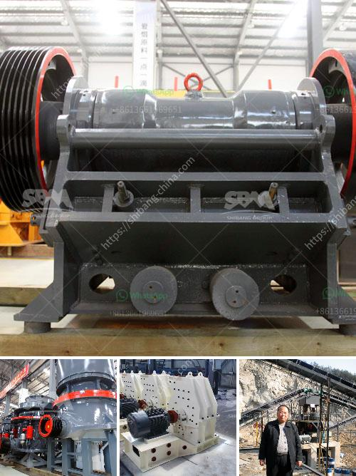

<h3>biering roller mill</h3>
In the world of grain processing, technological advancements have always played a vital role in improving efficiency and quality. Among the many innovations that have revolutionized this industry, the Biering Roller Mill stands out as a remarkable achievement. Developed in the early 20th century by the renowned engineer and inventor, John Biering, this mill has significantly changed the landscape of grain processing.

At its core, the Biering Roller Mill is a powerful machine designed to break down grains into more manageable and refined particles. This roller mill utilizes a unique mechanism that enables it to process grains with unparalleled precision and consistency. Unlike traditional milling methods that relied on stone grinding, the Biering Roller Mill utilizes a system of rollers that crush and separate the grains, resulting in a finer and more uniform final product.

One of the key features that sets the Biering Roller Mill apart from its predecessors is its ability to regulate the milling process with exceptional accuracy. The use of multiple rollers in this mill allows for greater control over the grinding process, ensuring that grains are crushed uniformly with each pass. This level of precision not only leads to a more consistent product but also enhances productivity by reducing wastage and enhancing throughput.

Furthermore, the Biering Roller Mill boasts a customizable setup, offering a range of roller sizes and configurations to suit various grain processing needs. This adaptability makes it an ideal choice for different types of grains, including wheat, barley, corn, or rye. The ability to adjust the roller settings allows operators to achieve specific particle sizes, catering to the diverse requirements of the food, brewing, and distilling industries.

In addition to its exceptional milling capabilities, the Biering Roller Mill also stands out for its durability and reliability. Built with high-quality materials and precision engineering, this machine has proven itself to be highly robust and capable of withstanding the demands of continuous operation. Its sturdy construction reduces the risk of mechanical failures and ensures optimal performance, even under heavy workloads.

The Biering Roller Mill also offers significant benefits in terms of maintenance and ease of operation. Its streamlined design and user-friendly controls make it straightforward to operate and maintain, minimizing downtime and maximizing productivity. Additionally, its innovative self-cleaning mechanism further reduces maintenance requirements, allowing grain processors to focus on their core operations.

The impact of the Biering Roller Mill on the grain processing industry cannot be overstated. Its unparalleled milling capabilities, precision control, adaptability, and durability have transformed the way grains are processed, setting new standards for efficiency and quality. This mill has surged in popularity among grain processors worldwide and has become an essential tool for those who strive for excellence in their operations.

In conclusion, the Biering Roller Mill shines as a revolutionary advancement in grain processing. With its superior milling capabilities, precise control, customizable setups, and robust construction, it has established itself as a game-changer in the industry. As technology continues to evolve, the Biering Roller Mill remains a beacon of innovation, driving efficiency and quality in grain processing to new heights.
<h3>Contact us</h3><ul><li><strong>Whatsapp:&nbsp;<a href="https://wa.me/8613661969651">+8613661969651</a></strong></li><li><a href="https://swt.shibang-china.com/?git&amp;zhl&amp;biering roller mill"><strong>Online Service(chat now)</strong></a></li></ul><h3>Related</h3><ul><li><a href='crushers stone crushers price.md'>crushers stone crushers price</a></li><li><a href='mobile stone crushing plant.md'>mobile stone crushing plant</a></li><li><a href='mobile crusher for sale in philippines.md'>mobile crusher for sale in philippines</a></li><li><a href='vibrating feeder sinter oret.md'>vibrating feeder sinter oret</a></li><li><a href='cinder block crushing machines for rent.md'>cinder block crushing machines for rent</a></li></ul>