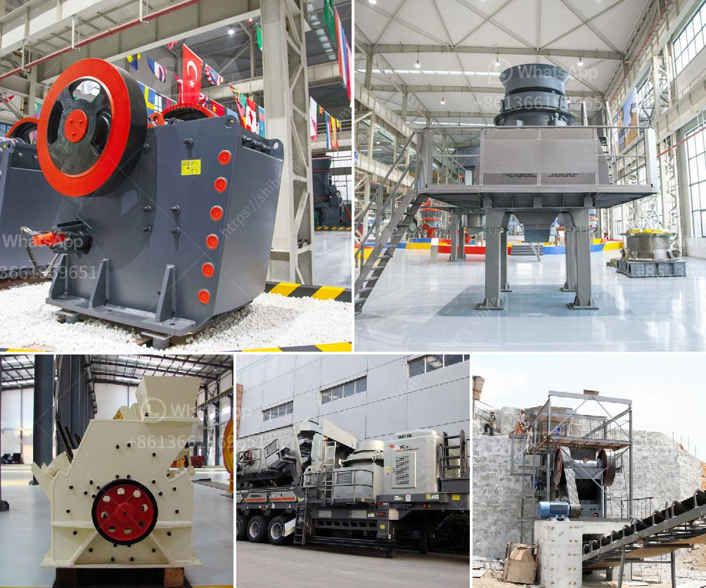

<h3>big crusher stones east london south africa</h3>
East London in South Africa is witnessing a surge in construction projects, and at the heart of these developments lies the powerful big crusher stones. These massive stones play a crucial role in the construction industry by being the primary ingredient in the production of concrete, asphalt, and various building materials. Their versatility, durability, and strength make them indispensable in creating stable structures that endure the test of time.

With a range of sizes and quality options, big crusher stones sourced from East London have gained a solid reputation amongst architects, engineers, and builders alike. These stones are extracted from local quarries, ensuring a high level of quality control and reducing transportation costs significantly. Their availability and affordability make them popular in housing, infrastructure, and commercial projects throughout South Africa.

One of the key advantages of using big crusher stones is their ability to withstand immense pressure. These stones are crushed into specific sizes through a carefully controlled process, which improves their density and quality. The hardened stones are capable of bearing heavy loads, making them ideal for foundations, roadways, and other applications where durability is critical.

East London, with its rich variety of minerals and resources, holds significant potential for the extraction of these big crusher stones. Besides providing valuable employment opportunities for the local population, the stone mining industry bolsters the economy of the region and supports the growth of construction projects.

However, it is important to note that sustainable and responsible mining practices should be upheld. Environmental regulations and guidelines must be strictly adhered to. Quarry operators should prioritize the restoration of mined areas, ensuring minimal impact on the surrounding ecosystem. By investing in restoration efforts and promoting environmental sustainability, the industry can continue to thrive in harmony with nature.

In conclusion, big crusher stones are the unsung heroes of the construction industry, providing the foundational strength that supports South Africa’s infrastructure growth. In East London, their availability and affordability make them a preferred choice for builders and developers. While maximizing their potential, it is crucial for stakeholders in the mining industry to prioritize environmental protection and restoration to ensure a sustainable future for all.
<h3>Contact us</h3><ul><li><strong>Whatsapp:&nbsp;<a href="https://wa.me/8613661969651">+8613661969651</a></strong></li><li><a href="https://swt.shibang-china.com/?git&amp;zhl&amp;big crusher stones east london south africa"><strong>Online Service(chat now)</strong></a></li></ul><h3>Related</h3><ul><li><a href='components of a limestone primary plant.md'>components of a limestone primary plant</a></li><li><a href='roll wheel pulverizer.md'>roll wheel pulverizer</a></li><li><a href='gold mining equipment nevada oregon used rock crushers.md'>gold mining equipment nevada oregon used rock crushers</a></li><li><a href='granite quarry companies in europe.md'>granite quarry companies in europe</a></li><li><a href='stone crusher in oman.md'>stone crusher in oman</a></li></ul>