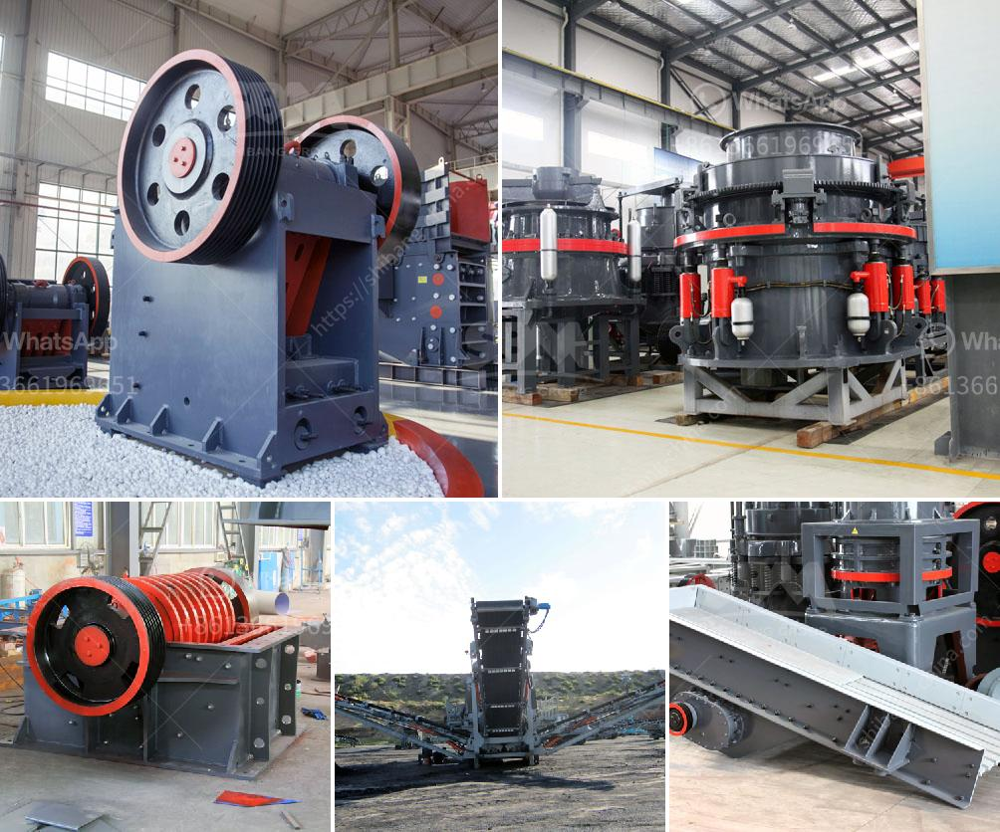

<h3>big impact crusher 1000 ton per hour</h3>
The usage and application of impact crusher is specifically for the production of sand and stone for construction purposes. It is also widely used in the mining industry as it has a high crushing ratio along with a large capacity and throughput.

One of the key features that make this machine so popular in the mining sector is its ability to produce a high-quality product at a faster rate. The impact crusher is capable of producing 1000 tons per hour, which can be used for industrial applications such as road construction, concrete production, and mining operations.

The machine utilizes a high-speed rotor with a crushing chamber that enables an efficient and effective crushing process. The rotor spins at a high speed, which allows the material to be crushed quickly and efficiently. The impact crusher also incorporates adjustable curtains or anvils, which allow the operator to control the size of the final product.

The big impact crusher is designed to accept large feed sizes and can be used as a primary or secondary crusher. It has a high reduction ratio, which provides high-quality end products. The machine is durable and easy to maintain, making it a reliable and cost-effective option for any crushing operation.

With its 1000 ton per hour capacity and the ability to produce a variety of different-sized products, the big impact crusher is versatile and adaptable. It can be used in many applications, including recycling, demolition, and quarrying. Whether processing construction waste or crushing limestone for a concrete plant, the impact crusher provides a reliable and efficient solution.

In addition to its capacity and versatility, the big impact crusher is also known for its low operating costs. It consumes less energy compared to other crushers in its class while still providing high-performance crushing. This makes it an ideal choice for businesses looking to maximize their production while minimizing expenses.

Furthermore, the big impact crusher is designed with safety and ease of use in mind. It features a hydraulic opening mechanism, which allows for easy access to the crushing chamber and rotor. This makes maintenance and inspections simple and reduces downtime, improving overall productivity.

In conclusion, the big impact crusher is a powerful and efficient machine that can significantly impact the productivity and profitability of mining and construction operations. With its high capacity, versatility, and low operating costs, it is a valuable asset for any crushing application. Whether used as a primary or secondary crusher, its ability to produce 1000 tons per hour makes it a reliable and efficient choice for any business.
<h3>Contact us</h3><ul><li><strong>Whatsapp:&nbsp;<a href="https://wa.me/8613661969651">+8613661969651</a></strong></li><li><a href="https://swt.shibang-china.com/?git&amp;zhl&amp;big impact crusher 1000 ton per hour"><strong>Online Service(chat now)</strong></a></li></ul><h3>Related</h3><ul><li><a href='magnetic enrichment of manganese ore.md'>magnetic enrichment of manganese ore</a></li><li><a href='stone crushers supply.md'>stone crushers supply</a></li><li><a href='portable cone crusher plant.md'>portable cone crusher plant</a></li><li><a href='used quarry crusher in south africa.md'>used quarry crusher in south africa</a></li><li><a href='marble processing machines.md'>marble processing machines</a></li></ul>