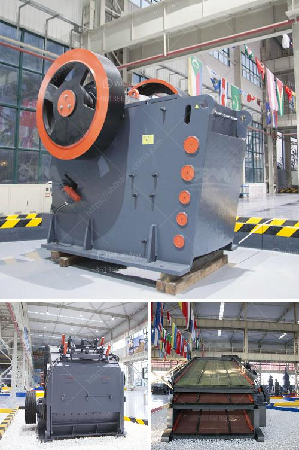

<h3>black stone crusher</h3>
Stone crushing industry is a crucial industrial sector in the country. It is often associated with mining operations and crushing rocks to produce finished products for construction and other purposes. The crushed stone industry is a major contributor to and an indicator of the economic well-being of a nation. The demand for crushed stone is directly proportional to the growth of construction activities in a country.

Black stone crushing equipment is the most commonly used type in mining industry. It is extremely versatile and can be used on various types of materials such as granite, limestone, ballast stone, andesite, volcanic rock, gypsum, calcite, sulfuric rock, river pebbles, marble, iron ore, copper ore, phosphate rock, red iron oxide, zircon sand, slag, cement clinker, activated carbon, dolomite, granite, cement, fly ash, and more. The black stone crusher is widely used in mining, smelting, building materials, highways, railways, water conservancy, and chemical industries.

Black stone crushers are capable of crushing stones in a very high ratio. They are capable of crushing any stone with a compression strength of about 2050 MPa, such as marble, limestone, granite, slate, and dolomite. The crushing process is characterized by the application of a force that can reach up to 300 MPa. The size of the crushed stones can be customized to achieve the desired size and uniformity.

One of the significant advantages of black stone crushers is their considerable output capacity. They can produce large quantities of crushed stones in a short period. The production rate can vary from 100 to 500 tons per hour. This high output capacity makes black stone crushers a lucrative investment option for businesses engaged in mining and construction activities.

Besides high production capacity, black stone crushers are also known for their energy efficiency. They are equipped with energy-saving motors that require minimal power consumption. This reduces the operational expenses associated with electricity bills. Additionally, these crushers are designed to have a low carbon footprint, which contributes to a cleaner and greener environment.

Another notable feature of black stone crushers is their robustness and durability. They are constructed using high-quality materials that can withstand heavy-duty operations and harsh working conditions. The wear-resistant parts, such as the hammerheads, are made from manganese steel and other alloy materials to ensure a prolonged service life.

In conclusion, black stone crushers have transformed the mining industry. They are capable of crushing a wide variety of materials and producing large quantities of crushed stones. With their high output capacity, energy efficiency, and durability, black stone crushers have become the preferred choice for many businesses engaged in mining and construction activities.
<h3>Contact us</h3><ul><li><strong>Whatsapp:&nbsp;<a href="https://wa.me/8613661969651">+8613661969651</a></strong></li><li><a href="https://swt.shibang-china.com/?git&amp;zhl&amp;black stone crusher"><strong>Online Service(chat now)</strong></a></li></ul><h3>Related</h3><ul><li><a href='formula de capacidad de chancadora.md'>formula de capacidad de chancadora</a></li><li><a href='granite quarry machines.md'>granite quarry machines</a></li><li><a href='cost of cassava milling machine in ghana.md'>cost of cassava milling machine in ghana</a></li><li><a href='indian river sand grinding machine price.md'>indian river sand grinding machine price</a></li><li><a href='zambia mobile crusher.md'>zambia mobile crusher</a></li></ul>