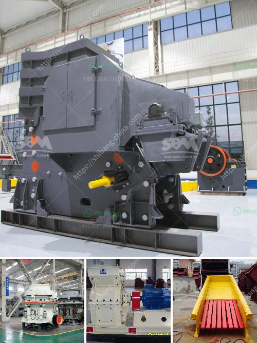

<h3>bresting and crushing concrete philippines</h3>
The construction industry in the Philippines has experienced tremendous growth over the years, leading to the need for innovative and efficient methods to overcome challenges faced in the field. One such technique that has gained popularity and revolutionized the industry is "breaking and crushing concrete." This method involves demolishing concrete structures using powerful equipment, allowing for easier removal and recycling. In this article, we will explore the benefits and advancements of breaking and crushing concrete in the Philippines, shedding light on its impact on construction practices.

Traditionally, demolition of concrete structures involved manual labor, which was not only time-consuming but also strenuous. With the advent of heavy-duty machinery specifically designed for breaking and crushing concrete, construction companies can now complete these tasks in a fraction of the time. Excavators equipped with hydraulic hammers or crushers enable swift and precise concrete demolition. Consequently, time-saving techniques like breaking and crushing concrete have become instrumental in meeting tight project schedules and improving overall productivity in the construction sector.

The environmental impact of the construction industry cannot be overlooked, especially in densely populated areas. Breaking and crushing concrete addresses this concern by allowing for effective recycling. Demolished concrete is usually crushed into aggregate materials of various sizes, which can be reused as a base for new structures or as fill material. This sustainable practice reduces the demand for natural resources, lowers the carbon footprint, and mitigates waste disposal issues, contributing significantly to environmental preservation.

Apart from its environmental benefits, breaking and crushing concrete also has economic advantages. The recycling of demolished concrete reduces disposal costs and landfill expenses, providing substantial savings for construction companies. Additionally, using recycled concrete as an alternative to natural aggregates reduces material costs without compromising the structural integrity of future projects. Thus, breaking and crushing concrete presents a win-win situation, promoting both sustainability and cost-effectiveness in the construction industry in the Philippines.

Another crucial aspect of breaking and crushing concrete is its positive impact on the health and safety of construction workers. By minimizing manual labor, the risk of injuries associated with traditional demolition practices is significantly reduced. Workers are no longer subjected to physical strain caused by repetitive and strenuous tasks. Instead, they can use advanced machinery remotely, ensuring better working conditions and enhanced job satisfaction. This, in turn, leads to a more motivated and productive workforce.

The introduction of breaking and crushing concrete techniques in the Philippines has revolutionized the construction industry in numerous ways. By offering cost-effective and time-saving solutions, this method has simplified the demolition process, boosting overall productivity. Furthermore, its eco-friendly aspects, such as reducing waste, conserving natural resources, and lowering carbon emissions, make it an indispensable tool for sustainable construction practices. As the Philippine construction sector continues to grow, breaking and crushing concrete will undoubtedly remain an integral part of the industry, improving efficiency, safety, and environmental sustainability.
<h3>Contact us</h3><ul><li><strong>Whatsapp:&nbsp;<a href="https://wa.me/8613661969651">+8613661969651</a></strong></li><li><a href="https://swt.shibang-china.com/?git&amp;zhl&amp;bresting and crushing concrete philippines"><strong>Online Service(chat now)</strong></a></li></ul><h3>Related</h3><ul><li><a href='limestone processing flow sheet.md'>limestone processing flow sheet</a></li><li><a href='quarry crusher equipment for sale.md'>quarry crusher equipment for sale</a></li><li><a href='gold mining equipment pdf.md'>gold mining equipment pdf</a></li><li><a href='ball mill manufacturer in india.md'>ball mill manufacturer in india</a></li><li><a href='sand making machine in south africa.md'>sand making machine in south africa</a></li></ul>