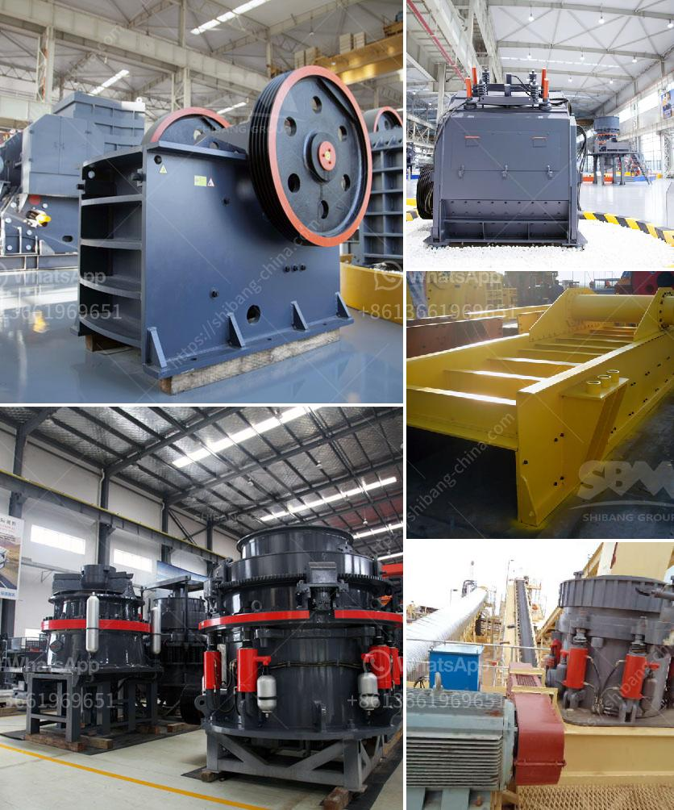

<h3>busines project proposal for stone crusher</h3>
To set up a stone crusher plant, project proposal is made through the submission of a detailed business plan including a feasibility report. This allows the investors to understand the overall market trends, size, and scope of the proposed project. The executive summary summarizes the company's goals and objectives, funding requirements, and potential returns on investment.

Stone crushing industry is an important industrial sector in producing crushed stone which is raw material for various construction activities like construction of roads, highways, bridges, buildings, canals, etc. Transportation of stone over long distances adds to cost of the crushed stone products, crushers need to be necessarily located nearer to the demand centers such as cities, bridges, canals, etc., Stone Crushers also need electricity supply and manpower for operation.

The objective is to obtain funds by providing loans from various banks for setting up a stone crushing plant in the surrounding of Manshera. The plant will be able to produce crushed stones of various sizes that can be used in various construction and road projects. The product will be hard lime stone crush of different sizes as required. The working of the stone crusher plant will be carried on a 24-hour basis, generating a sizeable workforce.

Stone crushing industry is an important industrial sector in the region. The stone crushing plant is located at the Kotwal quarry area of Akola District, Maharashtra. This area is situated approximately 20 km from Jh Napur, Maharashtra, and is well connected by roads, which are at an accessible distance from the project site. The availability of high-quality urban infrastructure and good social infrastructure like medical and educational facilities, etc., has increased the demand for crushed stones.

The purpose of this project is to provide support to existing stone crushers and to promote the utilization of manufactured sand (M-sand) as a substitute for river sand. M-sand is extensively used for the base course, concrete mix, plastering, and ceramic tile fixing activities in the construction industry.

The total estimated capital cost of the project is Rs. 100 million, which will be funded by share capital paid up capital, loan borrowing, and equity financing. A detailed financial analysis will be conducted to ensure the viability of the project.

This business project proposal is aimed at obtaining funds to set up a stone crusher plant in the surrounding of Manshera. The total amount of the initial capital required is Rs. 100 million. This amount will be utilized in the procurement of necessary machinery, infrastructure, and other necessary resources for the plant. Daily working capital will be required for the purchase of raw materials, fuel, maintenance, and labor costs. The project is expected to generate substantial revenue and profits for the investors within a short period. With the growing demand for crushed stones in the construction industry, setting up a stone crusher plant has great potential and can provide substantial returns on investment.
<h3>Contact us</h3><ul><li><strong>Whatsapp:&nbsp;<a href="https://wa.me/8613661969651">+8613661969651</a></strong></li><li><a href="https://swt.shibang-china.com/?git&amp;zhl&amp;busines project proposal for stone crusher"><strong>Online Service(chat now)</strong></a></li></ul><h3>Related</h3><ul><li><a href='sag mill grinding ball.md'>sag mill grinding ball</a></li><li><a href='kaolin crusher plant machinery.md'>kaolin crusher plant machinery</a></li><li><a href='lum vertical mill.md'>lum vertical mill</a></li><li><a href='kenya electrical jaw crusher 32 x 58.md'>kenya electrical jaw crusher 32 x 58</a></li><li><a href='conveyor belts for material.md'>conveyor belts for material</a></li></ul>