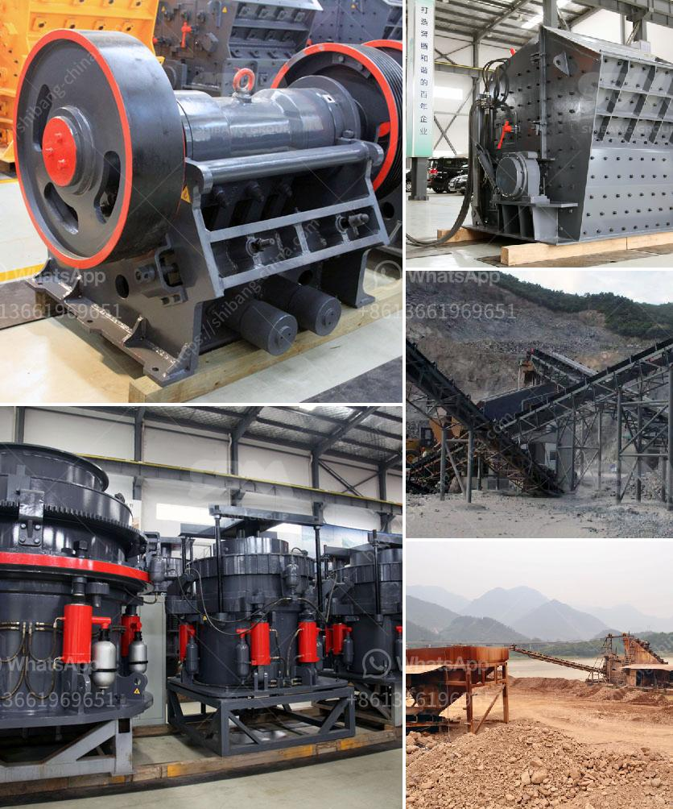

<h3>business plan for crushing and screening</h3>
A business plan for crushing and screening addresses how mining or aggregate production businesses intend to manufacture products, market them, and sell them to customers. The crushing and screening provision may include equipment, personnel, space, and other resources. If needed, the plan aims to identify potential investors, how to obtain permits for mining operations, and how to secure the necessary finances to cover initial costs. 

Firstly, the business plan outlines the location and target market for the crushing and screening operations. The plan may include research and analysis about the demand for specific products or services, identifying potential customers, and determining the competition in the area. This information not only helps to establish feasibility but also enables entrepreneurs to develop marketing strategies to attract and retain customers.

Next, the business plan highlights the necessary equipment and machinery needed for the crushing and screening operations. It includes a cost analysis of purchasing or leasing this equipment, along with operating costs for maintenance, fuel, and repairs. Additionally, staffing requirements, such as skilled operators, technicians, and management personnel, are addressed. Hiring and training plans should be discussed, ensuring a capable workforce to efficiently operate the machinery and equipment.

Furthermore, the business plan addresses the potential financial aspects of the operations. This includes a budget for obtaining permits, licenses, and insurance necessary for a legally compliant and insured operation. Any potential risks or contingencies should be identified and analyzed, alongside strategies to mitigate those risks. The plan may also detail potential revenue sources, such as selling products to wholesalers, contractors, or directly to end-users.

Finally, marketing and sales strategies are developed within the business plan to promote the products and attract customers. Identifying key selling points, differentiation factors, and competitive pricing methods will play a critical role in market penetration. Collaborating with suppliers, distributors, and other industry participants can also be outlined in this section.

In conclusion, a well-structured business plan for crushing and screening operations serves as a roadmap for entrepreneurs looking to establish a profitable and efficient operation. Addressing important aspects such as location, equipment, finances, and marketing strategies helps ensure that the business can effectively meet the demand for its products and services while maintaining a competitive edge in the industry.
<h3>Contact us</h3><ul><li><strong>Whatsapp:&nbsp;<a href="https://wa.me/8613661969651">+8613661969651</a></strong></li><li><a href="https://swt.shibang-china.com/?git&amp;zhl&amp;business plan for crushing and screening"><strong>Online Service(chat now)</strong></a></li></ul><h3>Related</h3><ul><li><a href='stone mill grinder for sale.md'>stone mill grinder for sale</a></li><li><a href='basalt crushing processing.md'>basalt crushing processing</a></li><li><a href='list used cement factory for sale in germany.md'>list used cement factory for sale in germany</a></li><li><a href='philippine crushing machine.md'>philippine crushing machine</a></li><li><a href='new mobile and fixed rock crushing plant.md'>new mobile and fixed rock crushing plant</a></li></ul>