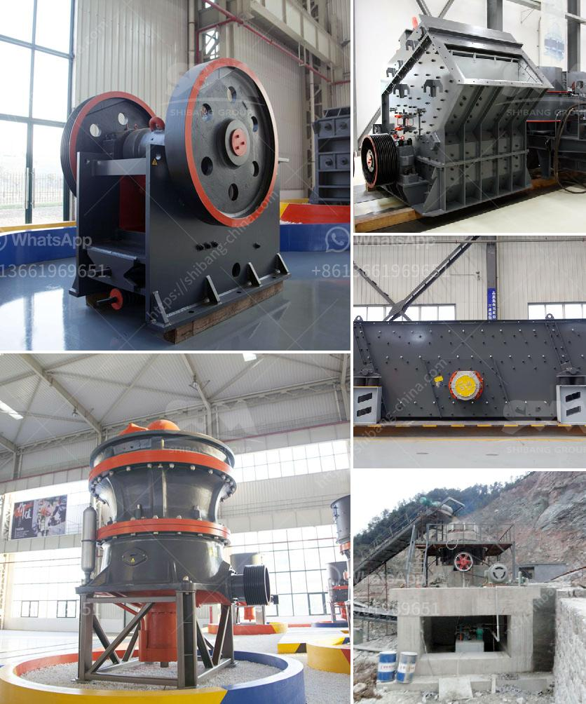

<h3>business plan for small mining processing plant</h3>
A business plan is essential for any endeavor, whether it is a small mining processing plant or any other business. A mining plant relies heavily on a solid business plan, as it is a crucial part of starting and maintaining your venture. In this article, we will outline the key components of a business plan for a small mining processing plant.

First and foremost, a clear and concise executive summary should be included. This section briefly highlights the purpose and goals of your mining plant. It should outline the type of minerals you plan to mine, the processing methods you intend to use, and your target market. This summary serves as an introduction to your business plan and will help potential investors or lenders understand the concept behind your project.

The next section should provide a detailed description of your mining processing plant. This includes information about the location of your plant, the size and capacity of the facility, as well as the equipment and machinery you plan to use. It is important to emphasize any unique features or advantages that your plant may have, as this will help differentiate you from competitors.

Market analysis is another crucial aspect of your business plan. This section should provide an overview of the mining industry, including trends, market size, and potential growth opportunities. It should also identify your target market, such as construction companies or manufacturing industries, and explain how your plant will meet their needs. Include information on your competitors and how you plan to compete in the market.

A comprehensive marketing and sales strategy is essential for the success of your mining processing plant. Outline your pricing strategy, distribution channels, and promotional activities. Consider the potential challenges and risks you may face and explain how you plan to overcome them. Having a well-defined marketing and sales strategy will help attract customers and secure contracts.

The financial section of your business plan should provide a detailed analysis of your projected costs, revenue, and profitability. Include information about your initial investment, operational expenses, and expected cash flow. It is important to demonstrate the potential return on investment (ROI) for potential investors or lenders. Consider including financial projections for at least three to five years, as this will show the long-term viability of your mining plant.

Lastly, it is important to include an organizational structure and management team section. Outline the roles and responsibilities of key personnel, including their qualifications and experience. If necessary, include a plan for recruitment and training of additional staff as the plant expands. Investors and lenders want to see that you have a competent and experienced team in place to successfully operate the mining processing plant.

In conclusion, a well-crafted business plan is crucial for the success of a small mining processing plant. It provides a roadmap for your venture and helps attract potential investors or lenders. Key components to include are the executive summary, plant description, market analysis, marketing and sales strategy, financial analysis, and organizational structure. By diligently preparing a comprehensive business plan, you increase the chances of a successful startup and sustainable growth for your mining processing plant.
<h3>Contact us</h3><ul><li><strong>Whatsapp:&nbsp;<a href="https://wa.me/8613661969651">+8613661969651</a></strong></li><li><a href="https://swt.shibang-china.com/?git&amp;zhl&amp;business plan for small mining processing plant"><strong>Online Service(chat now)</strong></a></li></ul><h3>Related</h3><ul><li><a href='vertical roller mill industrial.md'>vertical roller mill industrial</a></li><li><a href='roller crusher cad detail drawing.md'>roller crusher cad detail drawing</a></li><li><a href='stone crusher supplier company.md'>stone crusher supplier company</a></li><li><a href='static jaw crusher for sale.md'>static jaw crusher for sale</a></li><li><a href='pakistan directory of cement plants list pdf.md'>pakistan directory of cement plants list pdf</a></li></ul>