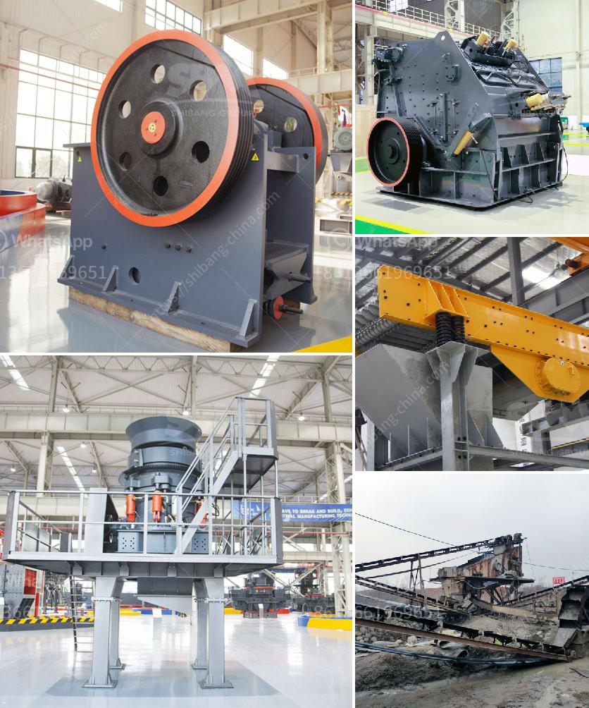

<h3>business plan south africa stone crusher</h3>
Business plan south Africa stone crusher is a lucrative business venture that requires a lot of strategic planning to get it started. Since launching a stone crusher can be a huge undertaking, even for seasoned entrepreneurs, getting this right from the start is critical.

As a result, this guide will give you a head start in the business. The following are key components of a stone crusher business plan:

When starting a stone crusher business, it’s critical to identify the target market and sizing up your competitors. Understand your customers’ needs and business relationships to determine the market size and competition. This knowledge will allow you to develop appropriate business strategies to penetrate the market successfully.

Choose a strategic location for your stone crusher business. This will have a huge impact on its success and profitability. Although you can operate from home, having a central location in a densely populated area will increase your visibility and reach. Ensure that the location is near a reliable source of raw materials to minimize transportation costs.

Develop a comprehensive business plan that details the purpose, mission, target market, competition, and financial projections of your stone crusher business. Your business plan will act as a roadmap to guide you through the various stages of your business journey. It will also be crucial when seeking financing from lenders or investors.

Before starting operations, obtain the necessary licenses and permits required to operate a stone crusher business in South Africa. Failure to acquire these permits can result in hefty fines or even the closure of the business. Consult with your local authorities to understand the specific requirements in your area.

Starting a stone crusher business requires a significant investment. You will need to secure funding to cover startup costs and operational expenses until the business becomes self-sustaining. Explore funding options such as bank loans, private investors, or government grants to finance your venture.

To set up a stone crusher business, you will need to purchase different machinery and equipment such as crushers, separators, screeners, conveyors, and storage locations. Select quality, reliable equipment from reputable suppliers. Consider factors such as productivity, operating costs, and maintenance requirements when making these purchasing decisions.

Promote your stone crusher business to create awareness and attract customers. Adopt cost-effective marketing strategies such as digital marketing, social media advertising, and local advertising. Network with construction companies, contractors, and suppliers to generate referrals and build business relationships.

Implement a robust financial management system to monitor your business's financial performance. This will help you track revenues, expenses, and profitability. Regularly review your financial statements and make necessary adjustments to improve efficiency and profitability.

Starting a stone crusher business in South Africa can be a daunting task, but with the right mindset, it is achievable. Ensure you follow all the necessary steps to establish a successful and sustainable business. By understanding the industry, drafting a comprehensive business plan, acquiring the required permits, sourcing capital, purchasing quality equipment, marketing strategically, and implementing a robust financial management system, you can set yourself up for success in the stone crusher industry.
<h3>Contact us</h3><ul><li><strong>Whatsapp:&nbsp;<a href="https://wa.me/8613661969651">+8613661969651</a></strong></li><li><a href="https://swt.shibang-china.com/?git&amp;zhl&amp;business plan south africa stone crusher"><strong>Online Service(chat now)</strong></a></li></ul><h3>Related</h3><ul><li><a href='dolomite crushing plant.md'>dolomite crushing plant</a></li><li><a href='ballast crusher for sale.md'>ballast crusher for sale</a></li><li><a href='65 tph cone crusher complete plant.md'>65 tph cone crusher complete plant</a></li><li><a href='grinding mill for limestone italy.md'>grinding mill for limestone italy</a></li><li><a href='coal and grinding machine cost.md'>coal and grinding machine cost</a></li></ul>