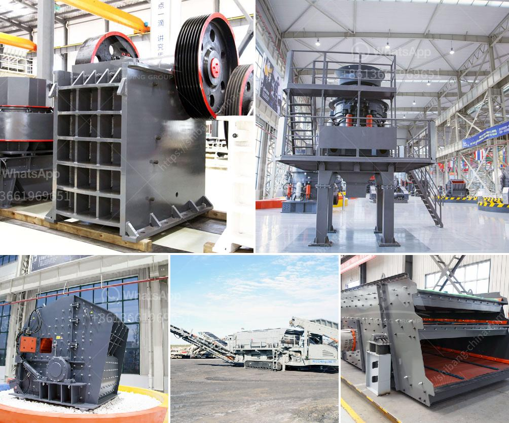

<h3>business proposal for stone quarry project</h3>
A stone quarry business is a capital intensive business that requires specialized investment and planning. The proposal for stone quarry project is all about the utilization of the stone deposit in the construction of roads, houses, bridges, buildings, and other structures. The actual quarrying work involves removal of overburden (overhang rocks) of blasted rock from the quarry, and then crushing and grading the quarry products into various sizes suitable for construction.

The proposed project shall be located at Limbo village, Ikot Abasi LGA, Akwa Ibom State. The quarry site is located along Lagos – Calabar expressway, about 0.5 km from the city centre and about 10 km away from Calabar – Itu highway. The project site covers an area of 10 hectares with plenty of deposits of granite.

The main objective of the project is to satisfy the increasing demand for crushed stone products for construction purposes within the vicinity of Limbo village. The project will also generate employment opportunities for the local community, and the revenue generated from the project will contribute to the socio-economic development of the area.

The estimated cost of the project is $250,000, which will cover the procurement of essential machinery, transportation, and installation, as well as working capital for the first quarter of operation. The project is expected to be profitable as the demand for crushed stone is continually rising due to the rapid urbanization and infrastructure development within the region.

To kickstart the project, we are seeking potential investors or partners who are interested in funding the project. In return, they will receive a percentage of the profits generated from the operation. Additionally, we are open to discussing revenue-sharing agreements or joint ventures with interested parties.

The stone quarry project is a government sponsored project and as such, will enjoy massive tax incentives and support from the government. The project is also environmentally friendly, as the quarrying activity will be undertaken using modern technology, minimizing the impact on the environment.

In conclusion, the stone quarry project involves a comprehensive and systematic approach that takes into consideration the local community, future generations, and the environment. The project is mutually beneficial for both investors and the local community, and is expected to bring socio-economic development to the area. Interested parties are invited to contact us to discuss investment opportunities and partnership options.
<h3>Contact us</h3><ul><li><strong>Whatsapp:&nbsp;<a href="https://wa.me/8613661969651">+8613661969651</a></strong></li><li><a href="https://swt.shibang-china.com/?git&amp;zhl&amp;business proposal for stone quarry project"><strong>Online Service(chat now)</strong></a></li></ul><h3>Related</h3><ul><li><a href='mining equipment tanzania.md'>mining equipment tanzania</a></li><li><a href='price of mobile stone crusher.md'>price of mobile stone crusher</a></li><li><a href='used concrete crushers for sale in ontario.md'>used concrete crushers for sale in ontario</a></li><li><a href='cement plants capacities of lafarge in nigeria.md'>cement plants capacities of lafarge in nigeria</a></li><li><a href='1 tonne roller mill.md'>1 tonne roller mill</a></li></ul>