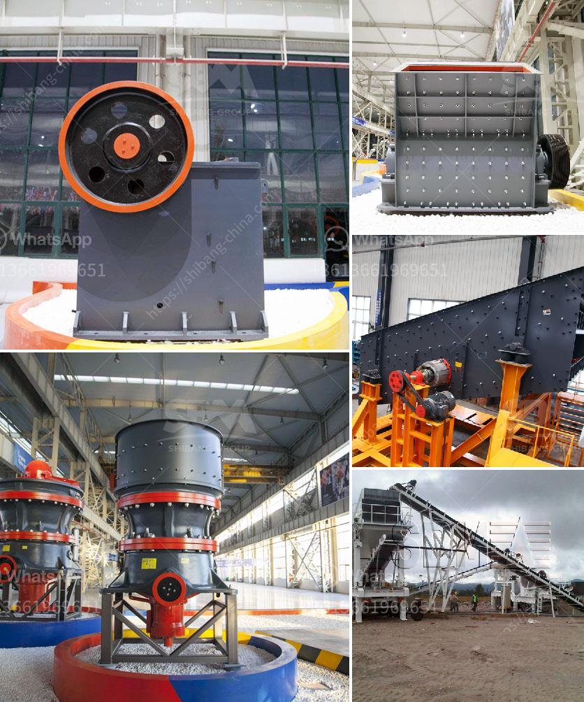

<h3>but concrete crushers nigeria</h3>
Concrete crushers are an important piece of machinery in the construction industry. These machines are used to crush large blocks of concrete into smaller pieces suitable for further construction work. In Nigeria, the use of concrete crushers is widespread due to the increasing demand for concrete in the construction industry.

One of the primary reasons for using concrete crushers is to reduce the disposal costs of demolition concrete. When buildings or structures are demolished, large amounts of concrete waste are generated. Instead of disposing of this waste, it can be crushed using concrete crushers and then recycled for future use in construction projects. This can significantly reduce the environmental impact of waste disposal, as well as save costs for construction companies.

Concrete crushers in Nigeria come in various sizes and types, including stationary crushers as well as mobile crushers. Some of the popular brands of crushers available in the market include Komatsu, Terex, and Metso, among others. The versatility and mobility of these machines enable efficient crushing of concrete at construction sites, thereby saving time and transportation costs.

In addition to cost savings, using concrete crushers in Nigeria also contributes to environmental sustainability. By recycling concrete waste through crushing, the need for extracting and processing natural aggregates is reduced. This reduces the demand for raw materials and energy, ultimately preserving natural resources and reducing carbon emissions associated with manufacturing new concrete.

Concrete crushers are also useful for creating recycled aggregate, which can be used as a substitute for conventional aggregates in various construction applications. Recycled aggregate is produced by crushing and sorting used concrete and can be used for making new concrete, road base, and other construction materials. This further reduces the need for extracting and processing virgin materials, promoting a more circular economy approach to construction.

Furthermore, concrete crushers in Nigeria can be used to crush other materials apart from concrete. For example, asphalt, brick, and stone can also be crushed using these machines, making them highly versatile. This allows contractors to handle different demolition and recycling applications with a single machine, enhancing efficiency and productivity on construction sites.

In conclusion, the use of concrete crushers in Nigeria is vital for reducing construction waste and promoting environmental sustainability. These machines not only save costs associated with waste disposal but also help conserve natural resources by recycling concrete for further use. The versatility and mobility of concrete crushers enable efficient on-site crushing, reducing transportation costs and promoting a circular economy in the construction industry. As the demand for sustainable construction practices continues to rise, the use of concrete crushers in Nigeria is set to increase, making them an essential tool for construction projects.
<h3>Contact us</h3><ul><li><strong>Whatsapp:&nbsp;<a href="https://wa.me/8613661969651">+8613661969651</a></strong></li><li><a href="https://swt.shibang-china.com/?git&amp;zhl&amp;but concrete crushers nigeria"><strong>Online Service(chat now)</strong></a></li></ul><h3>Related</h3><ul><li><a href='jaw crusher diagram.md'>jaw crusher diagram</a></li><li><a href='rotary breaker for coal 200tph.md'>rotary breaker for coal 200tph</a></li><li><a href='slag processing plant price in ghana.md'>slag processing plant price in ghana</a></li><li><a href='iron ore pellet plant technology suppliers.md'>iron ore pellet plant technology suppliers</a></li><li><a href='pf series impact crusher.md'>pf series impact crusher</a></li></ul>