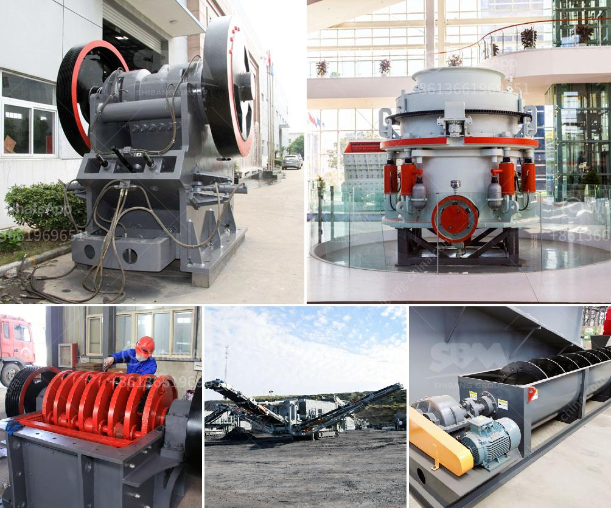

<h3>buy ballast crusher</h3>
Are you in the construction or mining industry and in need of a ballast crusher? Look no further, as we have the solution for you! Buying a ballast crusher can greatly improve your productivity and reduce your operating costs.

A ballast crusher is a machine that utilizes large stones as raw materials to crush and grind them into smaller pieces. The stones which are required for railway tracks, road construction, and concrete mixing plants, are constantly in high demand. To meet this growing need, you need a machine that can efficiently crush these stones into the desired shape and size.

Investing in a ballast crusher has several benefits. Firstly, it allows you to produce high-quality stones for your construction projects. This means that you can meet the standards set by regulatory agencies and deliver excellent results to your clients. The crusher ensures that the stones are evenly broken down, resulting in consistent quality materials.

Secondly, having a ballast crusher on site saves you transportation costs. Instead of purchasing stones from a quarry and having it delivered to your site, you can simply collect the raw materials and crush them on the spot. This not only saves you money but also ensures that you always have a steady supply of materials readily available.

Thirdly, a ballast crusher is easy to operate and maintain. It is designed with user-friendly features that make it simple to operate, even for beginners. Additionally, it requires minimal maintenance, ensuring that your machine remains functional for an extended period without any major issues.

Finally, purchasing a ballast crusher is a great long-term investment. As the demand for stones continues to rise in the construction industry, your machine will always be in high demand. Therefore, when the time comes to sell or upgrade your crusher, you can expect a high resale value or trade-in offer.

In conclusion, investing in a ballast crusher is a wise decision for anyone in the construction or mining industry. It guarantees you a steady supply of high-quality stones, reduces your transportation costs, and offers an easy-to-operate and maintain machine. So why wait? Get yourself a ballast crusher today and start reaping the benefits!
<h3>Contact us</h3><ul><li><strong>Whatsapp:&nbsp;<a href="https://wa.me/8613661969651">+8613661969651</a></strong></li><li><a href="https://swt.shibang-china.com/?git&amp;zhl&amp;buy ballast crusher"><strong>Online Service(chat now)</strong></a></li></ul><h3>Related</h3><ul><li><a href='barite mining crusher process.md'>barite mining crusher process</a></li><li><a href='vrm cement grinding.md'>vrm cement grinding</a></li><li><a href='crush rock industries nigeria.md'>crush rock industries nigeria</a></li><li><a href='coal powder plant.md'>coal powder plant</a></li><li><a href='gold stamp mill manufacturer in china.md'>gold stamp mill manufacturer in china</a></li></ul>