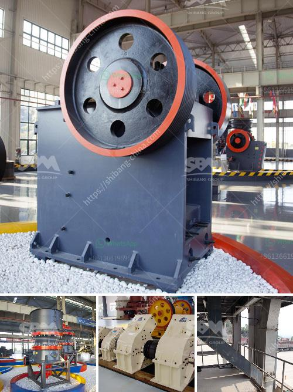

<h3>buy crushing and screening plant manufacture turkey</h3>
Turkey's flourishing mining industry presents significant opportunities for investors and manufacturers worldwide. With an increasing number of companies investing in mining projects and expanding their operations, the need for advanced equipment has grown exponentially. One area that has seen substantial growth is the manufacturing of crushing and screening plants in Turkey, which cater to the diverse needs of the mining industry. This article aims to shed light on the factors contributing to this industry's expansion and the benefits it offers to mining companies.

The mining industry is a vital contributor to Turkey's economy, providing jobs and driving economic growth. As exploration and extraction activities intensify, the demand for high-quality crushing and screening plants increases. These plants are vital for processing various minerals and aggregates necessary for construction, infrastructure development, and other industrial applications. Turkey's reliable and efficient crushing and screening plant manufacturers have emerged as key players to meet this demand.

Turkish manufacturers boast a wealth of experience in the mining machinery sector, backed by a long history of industrial development. With decades of expertise, they excel in designing and producing cutting-edge equipment that optimizes productivity and efficiency while ensuring durability. Enhanced technological capabilities have enabled Turkish manufacturers to develop flexible, custom-made crushing and screening plants that can handle diverse materials and adapt to different mining environments.

The Turkish crushing and screening plant manufacturing industry has thrived by emphasizing innovation and investing in research and development (R&D). Manufacturers embrace new technologies such as automation, IoT, and data analytics to enhance plant performance, reduce energy consumption, and streamline operations. The focus on R&D ensures Turkish manufacturers remain at the forefront of technological advancements, catering to the evolving demands of the global mining industry.

Turkish manufacturers have gained a reputation for delivering crushing and screening plants that adhere to global quality standards while being cost-effective. By utilizing advanced manufacturing processes, they optimize production efficiency and manage costs without compromising on the quality and performance of their products. This combination of quality and affordability has made Turkish crushing and screening plants highly sought-after by mining companies that value both reliability and budget-consciousness.

Turkey's crushing and screening plant manufacturers have successfully expanded their presence in the global market. They actively participate in international trade fairs and exhibitions, showcasing their products and establishing connections with potential buyers and partners. With competitive pricing models and versatile machinery, Turkish manufacturers have become preferred choices for mining companies worldwide seeking cost-effective and reliable solutions.

The manufacturing of crushing and screening plants in Turkey has witnessed remarkable growth, driven by the thriving mining industry and the expertise of Turkish manufacturers. The industry's ability to adapt to changing technologies, produce world-class quality products, and provide cost-effective solutions has contributed to its success. Turkish manufacturers' continued commitment to innovation and R&D ensures that they remain at the forefront of the global market, catering to the diverse needs of mining companies. As the mining industry continues to expand, Turkey's crushing and screening plant manufacturing sector is poised for further growth and global recognition.
<h3>Contact us</h3><ul><li><strong>Whatsapp:&nbsp;<a href="https://wa.me/8613661969651">+8613661969651</a></strong></li><li><a href="https://swt.shibang-china.com/?git&amp;zhl&amp;buy crushing and screening plant manufacture turkey"><strong>Online Service(chat now)</strong></a></li></ul><h3>Related</h3><ul><li><a href='sand manufacturing machine.md'>sand manufacturing machine</a></li><li><a href='mobile crusher machine in iran.md'>mobile crusher machine in iran</a></li><li><a href='iron jaw crusher with output of mm.md'>iron jaw crusher with output of mm</a></li><li><a href='silica sand mining equipment.md'>silica sand mining equipment</a></li><li><a href='prices crusher prices gypsum crusher prices.md'>prices crusher prices gypsum crusher prices</a></li></ul>