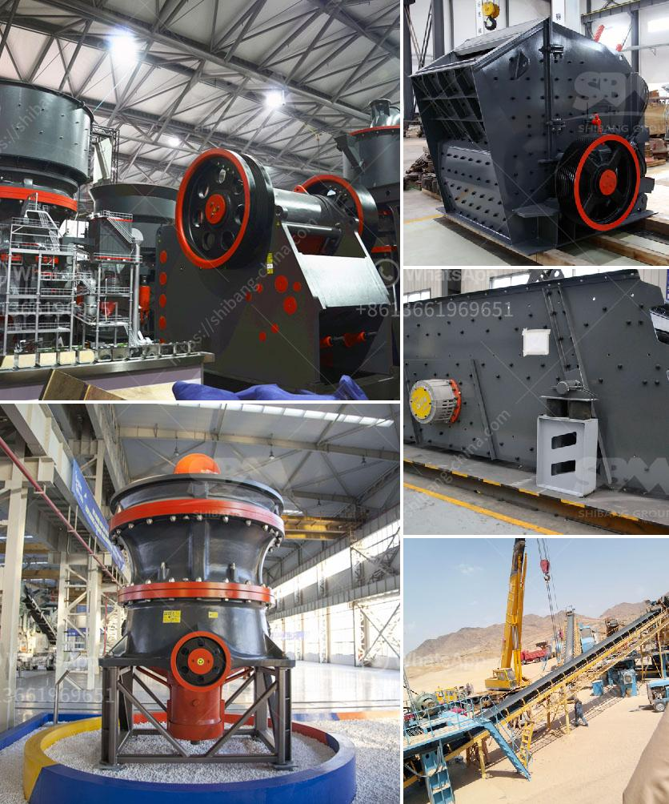

<h3>buy gravel crusher</h3>
If you are in the construction or mining industry, you know how crucial it is to have the right equipment to get the job done efficiently. One such equipment that plays a vital role in many projects is a gravel crusher. Whether you are working on a road construction project, creating aggregate for concrete, or mining for raw materials, a gravel crusher is an essential tool in your arsenal.

When it comes to purchasing a gravel crusher, there are several factors that you need to consider. One of the most important factors is the size and capacity of the crusher. Depending on your specific requirements, you may need a crusher that can handle tons of gravel per hour or a smaller crusher for smaller-scale projects. It is essential to analyze your needs carefully to ensure you make the right choice.

Another crucial aspect to consider is the quality and durability of the crusher. Investing in a high-quality crusher ensures that it will perform optimally for an extended period, reducing downtime and maintenance costs in the long run. Look for a crusher made from robust materials that can withstand the harsh conditions of a construction or mining site.

Furthermore, it is essential to choose a reputable manufacturer or supplier when buying a gravel crusher. A trusted supplier will provide you with reliable equipment that meets industry standards. They will also offer excellent customer service, including installation, maintenance, and any necessary technical support. Reading reviews and testimonials from other customers can help you determine the reputation of a supplier.

Lastly, don't forget to consider your budget. Take into account the initial cost of the gravel crusher, as well as the potential costs associated with maintenance, repairs, and spare parts. Make sure to compare prices from different suppliers to get the best value for your money without compromising on quality.

In conclusion, buying a gravel crusher is a significant investment for any construction or mining business. By considering factors such as size and capacity, quality and durability, reputation of the supplier, and budget, you can make an informed decision that will benefit your operations in the long run. Remember, a reliable gravel crusher can significantly improve productivity and efficiency, leading to successful and profitable projects.
<h3>Contact us</h3><ul><li><strong>Whatsapp:&nbsp;<a href="https://wa.me/8613661969651">+8613661969651</a></strong></li><li><a href="https://swt.shibang-china.com/?git&amp;zhl&amp;buy gravel crusher"><strong>Online Service(chat now)</strong></a></li></ul><h3>Related</h3><ul><li><a href='about aggregate crusher plants.md'>about aggregate crusher plants</a></li><li><a href='big crusher stones east london south africa.md'>big crusher stones east london south africa</a></li><li><a href='powder making machine price in pakistan.md'>powder making machine price in pakistan</a></li><li><a href='construction hammer mill.md'>construction hammer mill</a></li><li><a href='models of vibrating screens.md'>models of vibrating screens</a></li></ul>