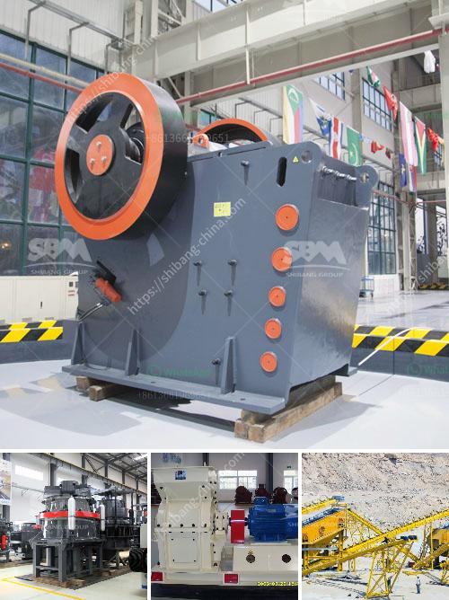

<h3>buy stone crusher india</h3>
India is one of the leading countries in the world when it comes to stone crushing. The country has been a proponent of the industry for decades now and continues to dominate the market with its top-notch machines. It is no surprise that the demand for stone crushers in India has been on the rise steadily.

Stone crushers are used for crushing stones and rocks into various sizes for construction purposes. These machines come in different types and are used for different purposes. Stone crushers are primarily used for crushing large stones into smaller ones or gravel. They are also used in stone processing and recycling. These machines have made the process of stone crushing easy and efficient.

The stone crusher industry in India is growing at a rapid pace and is expected to continue to expand in the years to come. India has a diverse population and is rich in mineral resources. The stone crushing industry is located in major industrial areas such as Mumbai, Delhi, and Chennai, among others. Stone crushers are important equipment in the construction industry as they help in reducing the size of large stones and rocks into smaller ones.

There are various types of stone crushers available in India, including cone crushers, jaw crushers, impact crushers, and more. Each type has its own advantages and features that cater to different requirements. For instance, cone crushers are ideal for secondary and tertiary crushing, while jaw crushers are suitable for primary crushing. Impact crushers, on the other hand, are used to produce finely crushed stones for highway construction and other similar projects.

Stone crushers in India are made of high-quality materials and precision engineering. These machines are built to withstand extreme conditions and are designed to provide optimal performance even in the toughest environments. They are easy to maintain and are highly efficient in crushing stones and rocks of all kinds.

Buying a stone crusher in India is a wise choice for those who have limited resources and want to maximize their investment. These machines are affordable and easy to use. They are also readily available in the market, making it convenient for buyers to find the right crusher for their needs. Furthermore, stone crushers are a sustainable option as they can be used for various projects over an extended period.

There are various factors to consider when buying a stone crusher in India. First and foremost, it is essential to assess the purpose and requirements of the machine. Buyers need to determine the size and type of stones they need to crush, the desired output size, and the quantity of stones they need to process. It is also crucial to consider aspects such as power consumption, maintenance requirements, and after-sales support.

In conclusion, the stone crusher industry in India is thriving due to the continued demand for high-quality machines. The variety of stone crushers available in the market caters to different needs, making them suitable for various projects. The investment in a stone crusher machine is a wise choice as it ensures maximum returns on investment and long-term productivity.
<h3>Contact us</h3><ul><li><strong>Whatsapp:&nbsp;<a href="https://wa.me/8613661969651">+8613661969651</a></strong></li><li><a href="https://swt.shibang-china.com/?git&amp;zhl&amp;buy stone crusher india"><strong>Online Service(chat now)</strong></a></li></ul><h3>Related</h3><ul><li><a href='difference between pebble and rock.md'>difference between pebble and rock</a></li><li><a href='mobile crusher supplier.md'>mobile crusher supplier</a></li><li><a href='stone crusher owners of khurda.md'>stone crusher owners of khurda</a></li><li><a href='china gold dry washer manufacturer in australia.md'>china gold dry washer manufacturer in australia</a></li><li><a href='crusher machine china.md'>crusher machine china</a></li></ul>