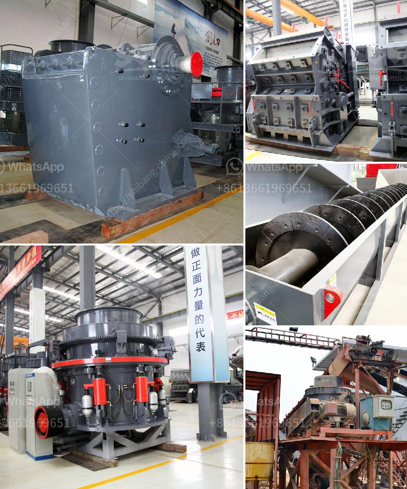

<h3>calcite processing machine</h3>
Calcite is a common mineral composed of calcium carbonate. It is widely used for its many industrial purposes, such as cement, fertilizer, and building materials. To process calcite into usable materials, you will need a calcite processing machine.

One such machine is the calcite grinding mill. It is an efficient and environmentally friendly mill that can grind calcite into different sizes required for various industries. The grinding mill is equipped with a powerful motor that ensures efficient grinding and reduces energy consumption.

Additionally, the calcite grinding mill has a special dust removal system that prevents the release of harmful particles into the air. This ensures a safe and healthy working environment. The machine also has a reliable and easy-to-use control system, allowing operators to adjust settings for desired results.

Another vital machine in the calcite processing line is the calcite crushing equipment. This machine is used to crush the large calcite chunks into smaller particles, making it easier to grind and process. The calcite crushing equipment is equipped with advanced technology and features a sturdy construction that guarantees durability and efficiency.

Furthermore, a calcite processing machine may include a calcite dryer. This machine removes moisture from the processed calcite, making it suitable for storage or further processing. The calcite dryer has precise temperature control and a user-friendly interface, ensuring convenient and consistent drying.

In conclusion, a calcite processing machine is essential for turning calcite into various usable materials. The machines mentioned above, including the calcite grinding mill, calcite crushing equipment, and calcite dryer, are designed to provide efficient and reliable processing solutions. With these machines, industries can obtain high-quality calcite products that meet their specific requirements.
<h3>Contact us</h3><ul><li><strong>Whatsapp:&nbsp;<a href="https://wa.me/8613661969651">+8613661969651</a></strong></li><li><a href="https://swt.shibang-china.com/?git&amp;zhl&amp;calcite processing machine"><strong>Online Service(chat now)</strong></a></li></ul><h3>Related</h3><ul><li><a href='portable stone crusher machine for sale.md'>portable stone crusher machine for sale</a></li><li><a href='quartz stone production line machinery.md'>quartz stone production line machinery</a></li><li><a href='mobile screening and crushing.md'>mobile screening and crushing</a></li><li><a href='coal processing plant in australia.md'>coal processing plant in australia</a></li><li><a href='calcium carbonate manufacturing machinery.md'>calcium carbonate manufacturing machinery</a></li></ul>