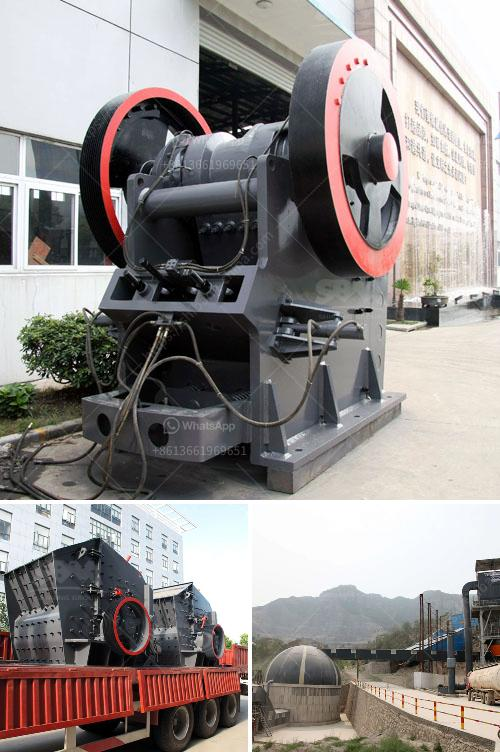

<h3>calcium carbonate ball milling</h3>
Calcium carbonate is a mineral that is commonly used in various industries, including the pharmaceutical, food, and chemical industries. It is a versatile compound that is often used as a filler or a coating agent due to its excellent properties.

One of the methods commonly used to produce calcium carbonate is ball milling. Ball milling involves the use of a mill chamber and grinding media, such as steel or ceramic balls, to crush and grind calcium carbonate into a fine powder.

This milling process consists of several stages, including initial crushing and pulverization, followed by finer grinding to produce a fine and uniform powder. The grinding media in the mill chamber crushes and grinds the calcium carbonate particles into a fine powder.

The ball milling process offers several advantages. Firstly, the fine size of the calcium carbonate particles obtained through ball milling ensures that they can be easily incorporated into various products without affecting their properties. Additionally, ball milling ensures a high degree of homogeneity in the final product.

Moreover, the use of grinding media in ball milling helps to increase the surface area of the calcium carbonate particles. This increased surface area enhances the reactivity and dissolution rate of calcium carbonate, making it more readily available for use in various applications.

Ball milling also offers the opportunity for controlling the size and shape of the calcium carbonate particles. By adjusting the milling parameters, such as the rotation speed of the mill and the type and size of grinding media, it is possible to obtain calcium carbonate powder with specific properties tailored to the desired application.

In conclusion, ball milling is a versatile and efficient method for producing calcium carbonate powder. It offers several advantages, including the ability to control particle size and shape, enhance reactivity, and achieve a high degree of homogeneity. With its numerous benefits, ball milling continues to be a widely used method for calcium carbonate production in various industries.
<h3>Contact us</h3><ul><li><strong>Whatsapp:&nbsp;<a href="https://wa.me/8613661969651">+8613661969651</a></strong></li><li><a href="https://swt.shibang-china.com/?git&amp;zhl&amp;calcium carbonate ball milling"><strong>Online Service(chat now)</strong></a></li></ul><h3>Related</h3><ul><li><a href='jaw crusher manufacturers in gujarat.md'>jaw crusher manufacturers in gujarat</a></li><li><a href='changing jaw on a crusher.md'>changing jaw on a crusher</a></li><li><a href='best mill for wet grinding of calcium carbonate.md'>best mill for wet grinding of calcium carbonate</a></li><li><a href='hydraulic cone crusher price.md'>hydraulic cone crusher price</a></li><li><a href='raymond mill machine upgrades powder mill machine.md'>raymond mill machine upgrades powder mill machine</a></li></ul>