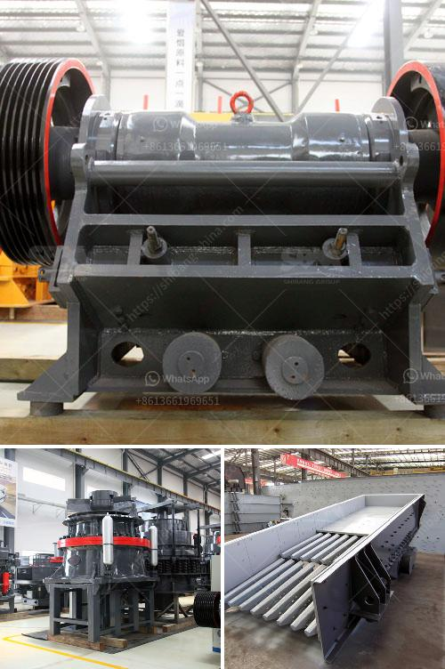

<h3>calcium carbonate for ball mill</h3>
Calcium carbonate, commonly known as limestone, is a widely used industrial material. It is an essential raw material in various industries including construction, agriculture, plastics, and paper. Calcium carbonate is usually obtained by grinding limestone or marble into a powder and then adding water to form a slurry. However, ball milling is often used as a final grinding step before blending raw materials.

In the cement industry, ball mills are predominantly used for the production of cement clinker. By combining various raw materials, such as limestone, clay, iron ore, and sand, a desired mixture is obtained. This mixture is heated at high temperatures to form a solid mass called cement clinker. The clinker is then ground into a fine powder, called cement, using ball mills.

The use of ball milling has several advantages over other grinding methods, such as roller mills or hammer mills. First, it offers a finer and more uniform grind for various materials, including those with high hardness. This is important for industries like plastics and paper, where a consistent particle size is required for specific applications.

Second, ball milling offers better control over the grinding process. The speed and duration of the milling process can be adjusted to obtain the desired particle size and distribution. This versatility allows manufacturers to produce different grades of calcium carbonate for specific uses.

Third, ball milling is energy-efficient. The power consumption of ball mills is relatively low compared to other grinding techniques. This is important for industries striving to reduce their carbon footprint and improve their sustainability.

To effectively use a ball mill for grinding calcium carbonate, manufacturers should consider several factors. First, they should choose the appropriate grinding media. Steel balls, ceramic beads, or other materials can be used to grind calcium carbonate effectively. The grinding media should be densely packed and should provide enough impact to break down the particles.

Second, the manufacturers should adjust the milling speed and duration. Higher speeds and longer grinding times result in finer particles, while lower speeds and shorter durations produce coarser particles. The optimal parameters depend on the desired particle size and distribution, as well as the specific properties of the calcium carbonate being used.

It is also important to keep the mill clean and well-maintained. Regular inspections and maintenance ensure that the mill operates at its full capacity and produces consistent results. Accumulation of calcium carbonate residue or other impurities may affect the grinding efficiency and product quality.

In summary, ball milling is a versatile and energy-efficient method for grinding calcium carbonate. It offers finer and more uniform particle size distribution, better control over the grinding process, and lower energy consumption compared to other grinding techniques. Manufacturers should consider factors such as grinding media, milling speed and duration, and regular maintenance to achieve optimal results. By employing ball milling, industries can produce high-quality calcium carbonate suitable for various applications, contributing to their overall success and competitiveness.
<h3>Contact us</h3><ul><li><strong>Whatsapp:&nbsp;<a href="https://wa.me/8613661969651">+8613661969651</a></strong></li><li><a href="https://swt.shibang-china.com/?git&amp;zhl&amp;calcium carbonate for ball mill"><strong>Online Service(chat now)</strong></a></li></ul><h3>Related</h3><ul><li><a href='quartz powder mill shanghaiu.md'>quartz powder mill shanghaiu</a></li><li><a href='automatic rolling mill manufacturer liberia.md'>automatic rolling mill manufacturer liberia</a></li><li><a href='basalt crushing production line.md'>basalt crushing production line</a></li><li><a href='profitable cement plant for sale in tamilnadu.md'>profitable cement plant for sale in tamilnadu</a></li><li><a href='stone hammer mill.md'>stone hammer mill</a></li></ul>