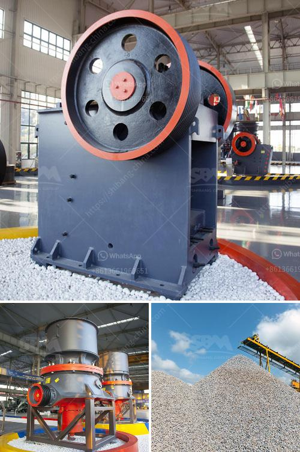

<h3>calcium carbonate grinder mill</h3>
Calcium carbonate grinder mill is a vital tool for grinding various materials into powder. With the increasing demand for calcium carbonate powder, the processing industry is experiencing a boom in its production. This mill provides a high degree of efficiency and precision that is crucial for producing top-quality powder.

The grinder mill uses a combination of abrasive grinding stones and high-pressure air jets to grind the materials. The stones rotate at a high speed, rubbing against each other and against the material being ground. This action helps break down the particles and reduce them to a fine powder.

One of the key advantages of using a calcium carbonate grinder mill is its ability to produce a uniform particle size distribution. The mill's design ensures that the grinding stones apply an equal amount of force on the material, resulting in consistent particle sizes. This feature is essential in industries such as pharmaceuticals, where the particle size is critical for drug efficacy.

Furthermore, the grinder mill is equipped with advanced control systems that allow operators to adjust the grinding parameters according to their requirements. The speed of the stones and the air pressure can be fine-tuned to achieve the desired particle size and consistency. This flexibility makes the grinder mill suitable for a wide range of applications, from food processing to chemical manufacturing.

Another advantage of using a calcium carbonate grinder mill is its ability to handle different types of materials. Apart from calcium carbonate, the mill can also grind materials such as limestone, dolomite, and even some types of ores. This versatility allows manufacturers to process a variety of raw materials and expand their product range.

In addition to its grinding capabilities, the grinder mill also offers energy efficiency. The mill is designed to minimize energy consumption while maintaining a high level of productivity. This not only helps manufacturers reduce their production costs but also contributes to environmental sustainability by conserving energy resources.

Furthermore, the grinder mill operates with minimal noise levels, thanks to its advanced insulation and soundproofing features. This makes it suitable for use in both industrial and residential areas, where noise pollution is a concern.

However, like any other machinery, the calcium carbonate grinder mill requires regular maintenance to ensure its optimal performance. The grinding stones need periodic replacement to maintain their sharpness, and the mill's components must be inspected and lubricated regularly to prevent wear and tear.

In conclusion, the calcium carbonate grinder mill is an indispensable tool for the processing industry. Its ability to produce a uniform particle size distribution, handle various materials, and offer energy efficiency and low noise levels make it a valuable asset for manufacturers. With proper maintenance, this mill can provide years of reliable service and contribute to the growth of diverse sectors.
<h3>Contact us</h3><ul><li><strong>Whatsapp:&nbsp;<a href="https://wa.me/8613661969651">+8613661969651</a></strong></li><li><a href="https://swt.shibang-china.com/?git&amp;zhl&amp;calcium carbonate grinder mill"><strong>Online Service(chat now)</strong></a></li></ul><h3>Related</h3><ul><li><a href='screening plant for hire south africa.md'>screening plant for hire south africa</a></li><li><a href='vertical coal mill.md'>vertical coal mill</a></li><li><a href='vibrating feeder sinter oret.md'>vibrating feeder sinter oret</a></li><li><a href='mining quarry equipment for sale sri lanka.md'>mining quarry equipment for sale sri lanka</a></li><li><a href='limestone crushers in ghana.md'>limestone crushers in ghana</a></li></ul>