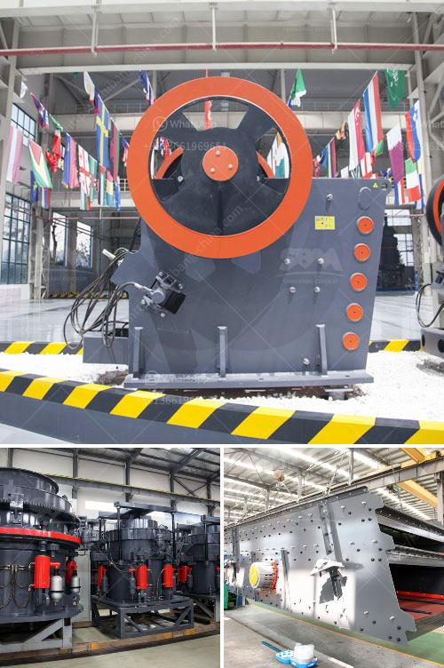

<h3>calcium carbonate limestone machine</h3>
Limestone is a naturally occurring sedimentary rock that is composed mainly of calcium carbonate (CaCO3). Calcium carbonate limestone machine is widely used in various industries, including mining and construction. It plays a vital role in many applications due to its mineralogical, chemical, and physical properties.

One of the primary uses of limestone is as a construction material. Its durability and strength make it an ideal choice for building houses, roads, and bridges. Additionally, when mixed with other materials, it can create concrete, which is a cornerstone of modern infrastructure.

Another important application of calcium carbonate limestone machine is in agriculture. Limestone is often used to neutralize acidic soils and provide essential nutrients to crops. When soil becomes too acidic, it can hinder plant growth and affect nutrient availability. By applying limestone, farmers can restore the soil's pH balance and enhance crop productivity.

In the industrial sector, calcium carbonate limestone machine is an essential ingredient in the production of paper, paint, plastic, and rubber. Its unique properties, such as brightness, whiteness, and opacity, make it an ideal filler and pigment for these industries. It adds value to the final product by improving its quality and performance.

Furthermore, calcium carbonate limestone machine is widely used in the manufacturing of glass. Adding limestone to glass composition helps achieve better transparency, thermal stability, and chemical resistance. It also reduces the melting temperature, thereby saving energy during the glass manufacturing process.

The mining and processing of calcium carbonate limestone require specialized machinery. These machines are designed to extract and process limestone rock efficiently and economically. The primary equipment used in the process is the calcium carbonate limestone machine, which crushes the raw material into smaller sizes suitable for further processing.

Various crushing and grinding techniques are employed to break down the limestone rock and reduce it to the desired size. Once the desired particle size is achieved, the limestone is subjected to additional processes, such as classification, flotation, and drying. These processes further refine the material and remove impurities to produce high-quality calcium carbonate limestone powder.

The development of advanced calcium carbonate limestone machines has significantly improved the efficiency and productivity of limestone mining and processing operations. Modern machines are equipped with advanced features, such as automated controls, energy-efficient motors, and improved safety mechanisms. These advancements have not only reduced production costs but also minimized environmental impact.

The calcium carbonate limestone machine industry continues to evolve, driven by the increasing demand for limestone products across various sectors. Manufacturers are investing in research and development to improve machine performance, reduce energy consumption, and enhance product quality.

In conclusion, the calcium carbonate limestone machine has revolutionized various industries by providing a versatile and valuable material. Its unique properties make it indispensable in construction, agriculture, manufacturing, and many other fields. As technology continues to advance, we can expect further improvements in calcium carbonate limestone machines, making them even more efficient and eco-friendly.
<h3>Contact us</h3><ul><li><strong>Whatsapp:&nbsp;<a href="https://wa.me/8613661969651">+8613661969651</a></strong></li><li><a href="https://swt.shibang-china.com/?git&amp;zhl&amp;calcium carbonate limestone machine"><strong>Online Service(chat now)</strong></a></li></ul><h3>Related</h3><ul><li><a href='raymond mill machine upgrades powder mill machine.md'>raymond mill machine upgrades powder mill machine</a></li><li><a href='grinder mill bogota.md'>grinder mill bogota</a></li><li><a href='industrial vibrating screen price.md'>industrial vibrating screen price</a></li><li><a href='chrome processing and drying.md'>chrome processing and drying</a></li><li><a href='gypsum manufacturers in azerbaijan.md'>gypsum manufacturers in azerbaijan</a></li></ul>