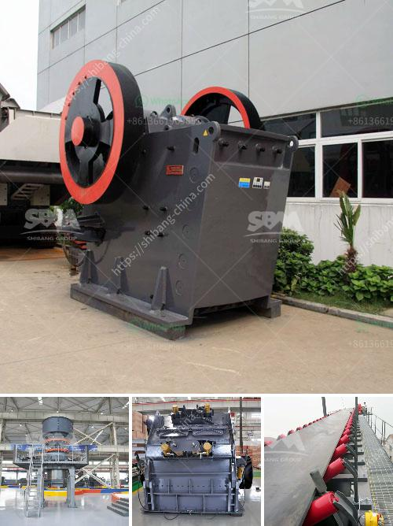

<h3>calcium carbonate manufacturing machinery</h3>
Calcium carbonate is a chemical compound composed of carbon, oxygen, and calcium. It is a common substance found in rocks in all parts of the world and is the main component of shells of marine organisms, snails, coal balls, pearls, and eggshells. Calcium carbonate is used in various industries such as construction, agriculture, and pharmaceuticals.

Manufacturing calcium carbonate is a complex process that involves several steps. First, limestone, a sedimentary rock, is crushed into smaller stones. Then, the stones are subjected to various machines, including jaw crushers, gyratory crushers, cone crushers, and vertical shaft impactors, to reduce their size further.

After crushing, the limestone is processed in grinding mills to produce a fine powder. The powder is then milled to achieve a specific particle size distribution, which can range from fine to ultra-fine. This milling process requires specialized machinery such as ball mills, vertical roller mills, and jet mills.

In ball mills, the limestone is ground to a specified fineness by the impact and pressure of the grinding media. The ground calcium carbonate is collected in a cyclone separator, while the coarser particles are returned to the mill for further grinding. Vertical roller mills use the principle of compression to grind the limestone, resulting in a more uniform particle size distribution.

Jet mills, also known as fluid energy mills, utilize high-speed jets of compressed air or steam to impact particles and reduce their size. They are often used to produce ultra-fine calcium carbonate with particle sizes as small as a few micrometers.

Once the desired particle size is achieved, the calcium carbonate powder is collected and stored in silos. From there, it can be packaged and transported to various industries for further processing.

The machinery used in calcium carbonate manufacturing plays a crucial role in determining the quality of the final product. The efficiency and reliability of the machinery are essential to ensure consistent production and minimize downtime.

To meet the increasing demand for calcium carbonate, manufacturers are continually investing in advanced machinery that offers higher capacity, energy efficiency, and improved product quality. Modern machinery incorporates features such as automated controls, advanced wear protection, and innovative grinding technologies to optimize production and reduce operational costs.

In conclusion, calcium carbonate manufacturing machinery plays a vital role in producing high-quality calcium carbonate powder. The process involves crushing, grinding, and milling limestone into a fine powder, which is then processed and stored in silos. Manufacturers are constantly investing in advanced machinery to meet the growing demand for calcium carbonate and optimize the production process. By utilizing modern technologies and equipment, manufacturers can ensure efficient production, consistent product quality, and cost-effective operations.
<h3>Contact us</h3><ul><li><strong>Whatsapp:&nbsp;<a href="https://wa.me/8613661969651">+8613661969651</a></strong></li><li><a href="https://swt.shibang-china.com/?git&amp;zhl&amp;calcium carbonate manufacturing machinery"><strong>Online Service(chat now)</strong></a></li></ul><h3>Related</h3><ul><li><a href='iron ore processing plant in mexico.md'>iron ore processing plant in mexico</a></li><li><a href='crusher plant for coal.md'>crusher plant for coal</a></li><li><a href='double roller crusher supplier.md'>double roller crusher supplier</a></li><li><a href='equipment for mineral ore mining industry.md'>equipment for mineral ore mining industry</a></li><li><a href='crushing plants pawer screen.md'>crushing plants pawer screen</a></li></ul>