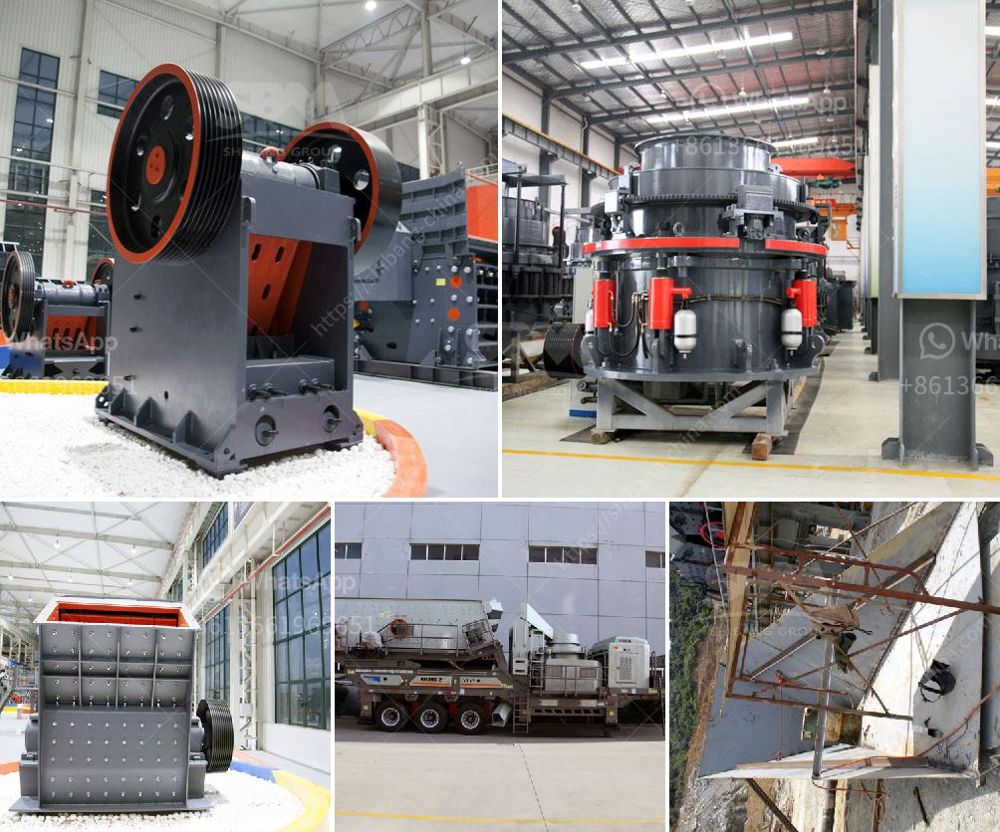

<h3>calcium carbonate plants in china</h3>
Calcium carbonate plants in China have a rich heritage dating back to the ancient times when the substance was used for various purposes in construction and medicine. Today, calcium carbonate is a key ingredient in many industrial applications and is highly sought after worldwide.

China is one of the largest producers of calcium carbonate, accounting for more than 30% of global production. The country's abundant limestone reserves and advanced manufacturing technologies have made it a dominant player in the global calcium carbonate market. The presence of numerous calcium carbonate plants across China further solidifies its position as a leader in this industry.

The production process of calcium carbonate involves extracting limestone from quarries or mines, then crushing and grinding it into a fine powder. This powder is then mixed with water to create a slurry, which is further processed through various stages to produce calcium carbonate in its desired form.

One of the main uses of calcium carbonate is in the construction industry. It is widely used as a filler material in cement, concrete, and other construction materials. Its high calcium content contributes to the strength and durability of these materials, making them ideal for building structures that can withstand harsh environmental conditions.

Calcium carbonate also finds extensive use in the paper industry. It is added to the pulp during the paper manufacturing process to improve paper whiteness, opacity, and smoothness. By enhancing these properties, calcium carbonate helps to produce high-quality paper products that are widely used in printing, packaging, and other applications.

Furthermore, calcium carbonate is utilized in the production of plastics, paints, adhesives, and various other industrial products. Its unique chemical properties make it a versatile additive that can modify the characteristics of these materials, enhancing their performance and functionality.

What sets Chinese calcium carbonate plants apart is their commitment to sustainability and environmental responsibility. Many plants in China have implemented advanced technologies to reduce energy consumption and minimize environmental impact. They have invested in efficient production processes and waste management systems to ensure that the production of calcium carbonate is as eco-friendly as possible.

As China continues to invest in infrastructure development and industrial growth, the demand for calcium carbonate is expected to rise. This provides a significant opportunity for calcium carbonate plants in China to expand their production capacity and meet the growing needs of various industries, both domestically and internationally.

However, it is essential for calcium carbonate plants to maintain a balance between production and environmental conservation. Efforts should be made to minimize the carbon footprint and reduce waste generation. Additionally, continuous research and development efforts should be undertaken to explore new applications and ways to make calcium carbonate production more sustainable and efficient.

In conclusion, calcium carbonate plants in China play a vital role in meeting the global demand for this versatile compound. With their abundant limestone reserves and advanced manufacturing technologies, Chinese plants are capable of providing high-quality calcium carbonate to various industries. By focusing on sustainability and environmental responsibility, these plants can ensure the long-term viability of calcium carbonate production while contributing to China's economic growth.
<h3>Contact us</h3><ul><li><strong>Whatsapp:&nbsp;<a href="https://wa.me/8613661969651">+8613661969651</a></strong></li><li><a href="https://swt.shibang-china.com/?git&amp;zhl&amp;calcium carbonate plants in china"><strong>Online Service(chat now)</strong></a></li></ul><h3>Related</h3><ul><li><a href='sayaji impact crusher specifications.md'>sayaji impact crusher specifications</a></li><li><a href='cone crusher sri lanka for sale.md'>cone crusher sri lanka for sale</a></li><li><a href='conveyor belt seller in korea.md'>conveyor belt seller in korea</a></li><li><a href='used cement mills for sale in india.md'>used cement mills for sale in india</a></li><li><a href='used rotary kiln equipment for sale.md'>used rotary kiln equipment for sale</a></li></ul>