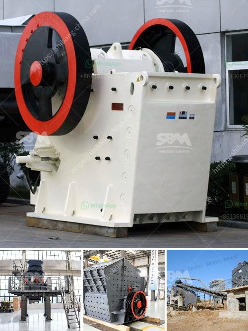

<h3>calcium carbonate powder mill price</h3>
Calcium carbonate powder mill is an essential and resourceful industrial tool that is used in various industries, including pharmaceutical, chemical, paint, and coatings. Calcium carbonate is a versatile mineral compound that has many unique properties and applications. The powder mill is used to process different grades of calcium carbonate powder, which are then used in numerous manufacturing and processing industries.

The price of calcium carbonate powder mill is a crucial factor that influences the decision-making process of the buyers. The cost should not only be affordable but also sustainable and in line with the market standards. It is important to strike a balance between competitive pricing and maintaining the quality of the product.

When it comes to calcium carbonate powder mill price, several factors come into play. The first and foremost factor is the quality of the mill. A high-quality mill ensures efficient and effective processing, thus improving the powder's overall quality and consistency. The price of a mill might vary depending on its design, construction material, and technological advancement.

Other factors that influence the price include the capacity of the mill, its motor power, and the fineness of the powder it can produce. Higher capacity and better motor power allow for faster and more productive operations, which can result in increased output. Similarly, the ability to produce finer powder ensures greater versatility and application possibilities.

Furthermore, the price of calcium carbonate powder mill should also consider the cost of maintenance and after-sales services. An affordable mill might become costly in the long run if it requires frequent repairs or if the manufacturer does not provide satisfactory after-sales support.

In conclusion, while searching for a calcium carbonate powder mill, it is crucial to consider not only the price but also the quality, capacity, fineness, and after-sales support. Striking the right balance between price and product quality is essential for sustainable development in the industrial sector. By choosing a reliable and cost-effective mill, companies can ensure smooth manufacturing operations and contribute towards environmental and economic sustainability.
<h3>Contact us</h3><ul><li><strong>Whatsapp:&nbsp;<a href="https://wa.me/8613661969651">+8613661969651</a></strong></li><li><a href="https://swt.shibang-china.com/?git&amp;zhl&amp;calcium carbonate powder mill price"><strong>Online Service(chat now)</strong></a></li></ul><h3>Related</h3><ul><li><a href='list of quarrying companies in the philippines.md'>list of quarrying companies in the philippines</a></li><li><a href='stone crusher sand vs river sand for construction.md'>stone crusher sand vs river sand for construction</a></li><li><a href='manufacturer of conveyor belts.md'>manufacturer of conveyor belts</a></li><li><a href='pebble production line.md'>pebble production line</a></li><li><a href='quartz powder special production line for mining.md'>quartz powder special production line for mining</a></li></ul>