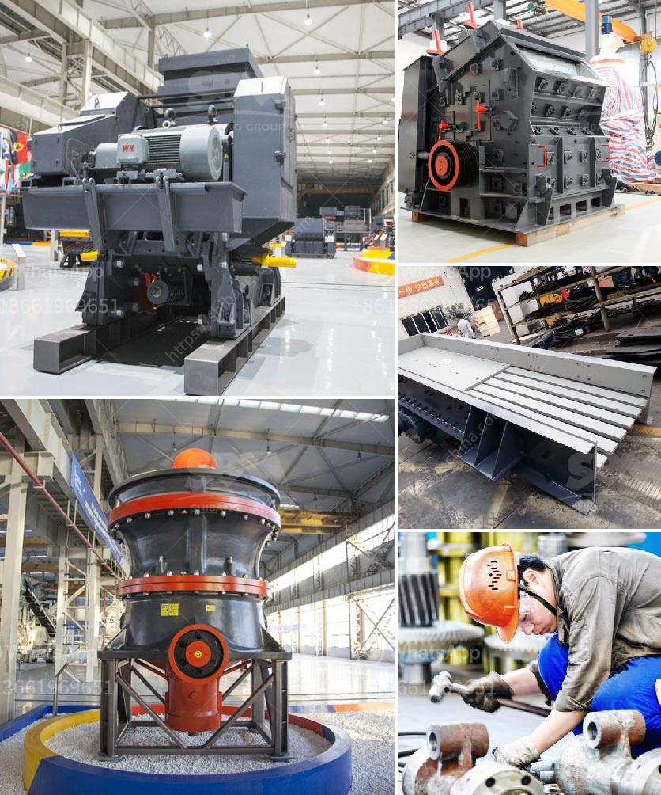

<h3>calcium carbonate process flow diagram</h3>
Calcium carbonate, also known as limestone, is a compound that is primarily found in rocks and minerals such as calcite and aragonite. It is widely used in various industries, including paper manufacturing, plastics, paints, coatings, and even in certain food and pharmaceutical applications. The process flow diagram of calcium carbonate production is complex and involves various stages such as crushing, grinding, and disaggregation.

The first step in the production of calcium carbonate is the quarrying of limestone. This involves the extraction of limestone from rocks or mines. Depending on the source, the limestone may contain impurities, such as silica or clay, which must be removed through a process known as beneficiation. This process involves crushing and grinding the limestone to a fine powder.

After the limestone has been crushed and ground, it is then subjected to a series of flotation or settling processes to remove impurities. During flotation, impurities such as silica or clay are selectively separated from the limestone. This is achieved by using chemicals, known as flotation reagents, which selectively bind to the impurities and allow them to float to the surface. The impurities can then be removed, leaving behind a purified limestone.

Once the impurities have been removed, the purified limestone is then subjected to further grinding and drying processes. The grinding process involves the use of a mill, such as a ball mill or a hammer mill, to reduce the limestone to a fine powder. This powder is then dried in a rotary or fluidized bed dryer to remove any remaining moisture.

The dried limestone powder is then conveyed to a storage silo or directly into trucks or rail cars for transportation to the end user. At the end user's facility, the calcium carbonate is typically mixed with other additives and processed further to meet specific requirements. For example, in the paper industry, calcium carbonate is typically coated with a surface treatment to improve its brightness and printability.

In summary, the process flow diagram of calcium carbonate production involves several stages, including quarrying, beneficiation, flotation or settling, grinding, and drying. Each stage is important for producing high-quality calcium carbonate with the desired properties. The process requires careful control of various parameters, such as particle size, moisture content, and impurity levels, to ensure consistent and reliable production.

Overall, calcium carbonate is a versatile compound that plays a crucial role in various industries. Its production process is complex, involving multiple stages and careful control of various parameters. Understanding the process flow diagram of calcium carbonate production can help to appreciate the effort and expertise required to produce this essential compound.
<h3>Contact us</h3><ul><li><strong>Whatsapp:&nbsp;<a href="https://wa.me/8613661969651">+8613661969651</a></strong></li><li><a href="https://swt.shibang-china.com/?git&amp;zhl&amp;calcium carbonate process flow diagram"><strong>Online Service(chat now)</strong></a></li></ul><h3>Related</h3><ul><li><a href='stone crushers for sale in philippines.md'>stone crushers for sale in philippines</a></li><li><a href='indonesia quality crusher conveyor belts.md'>indonesia quality crusher conveyor belts</a></li><li><a href='vibrating crushing plant.md'>vibrating crushing plant</a></li><li><a href='zevith simple stone crushers kenya.md'>zevith simple stone crushers kenya</a></li><li><a href='machine grinds talcum powder.md'>machine grinds talcum powder</a></li></ul>