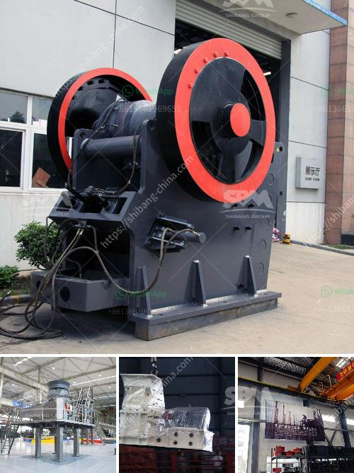

<h3>calcium carbonate processing plant price</h3>
Calcium carbonate is a widespread mineral compound found in rocks, shells, and pearls. The natural mineral is extracted from quarries, crushed into a fine powder, and used as a filler or additive in various industries, including plastics, coatings, construction materials, and pharmaceuticals. With the increasing demand for calcium carbonate, setting up a processing plant becomes a lucrative investment opportunity. However, the price of a calcium carbonate processing plant can vary depending on several factors.

One of the primary factors affecting the price of a calcium carbonate processing plant is the capacity. The larger the capacity, the higher the cost. A processing plant with a higher capacity requires more equipment, which adds to the overall expense. Additionally, a higher capacity processing plant may require a larger area for installation, thus increasing construction costs.

The quality of the equipment used in the processing plant also influences its price. High-quality equipment may be more expensive but can provide better performance and durability, leading to more efficient production processes and reduced maintenance costs in the long run. Investing in top-notch machinery ensures a better return on investment and higher profitability.

Furthermore, the automation level of the processing plant affects its price. Highly automated plants are more expensive but offer advantages such as increased productivity, improved product consistency, and reduced labor costs. Automation also enhances safety and reduces the risk of human error, resulting in smoother operations. These benefits outweigh the initial investment cost for many manufacturers.

Another factor influencing the price is the location of the processing plant. The cost of land, labor, and energy varies from one region to another. Choosing a location with lower labor and energy costs can significantly reduce the overall investment required for the processing plant. Additionally, proximity to the raw material source helps minimize transportation costs and ensures a steady supply of calcium carbonate.

Furthermore, environmental regulations and permits can contribute to the overall cost of setting up and operating a calcium carbonate processing plant. Compliance with environmental standards may require additional investments in pollution control systems and waste management facilities. However, adhering to these regulations is crucial for sustainable and responsible manufacturing practices.

It is essential to consider all these factors when determining the price of a calcium carbonate processing plant. While the initial investment may seem high, a well-designed and efficient plant can generate significant profits in the long term. To ensure the feasibility of the project, manufacturers should conduct a thorough cost analysis, considering all the essential aspects.

In conclusion, the price of a calcium carbonate processing plant depends on various factors, ranging from capacity and quality of equipment to automation level and location. Considering these factors can help manufacturers make informed decisions and optimize their investment. With the right planning and careful consideration, setting up a calcium carbonate processing plant can be a profitable endeavor in the growing market.
<h3>Contact us</h3><ul><li><strong>Whatsapp:&nbsp;<a href="https://wa.me/8613661969651">+8613661969651</a></strong></li><li><a href="https://swt.shibang-china.com/?git&amp;zhl&amp;calcium carbonate processing plant price"><strong>Online Service(chat now)</strong></a></li></ul><h3>Related</h3><ul><li><a href='stone crusher in jos plateau state nigeria.md'>stone crusher in jos plateau state nigeria</a></li><li><a href='fine powder grinders machine.md'>fine powder grinders machine</a></li><li><a href='used equipment cement for sale vertical roller mills.md'>used equipment cement for sale vertical roller mills</a></li><li><a href='steel hammer mill.md'>steel hammer mill</a></li><li><a href='used quarry crusher for sale.md'>used quarry crusher for sale</a></li></ul>