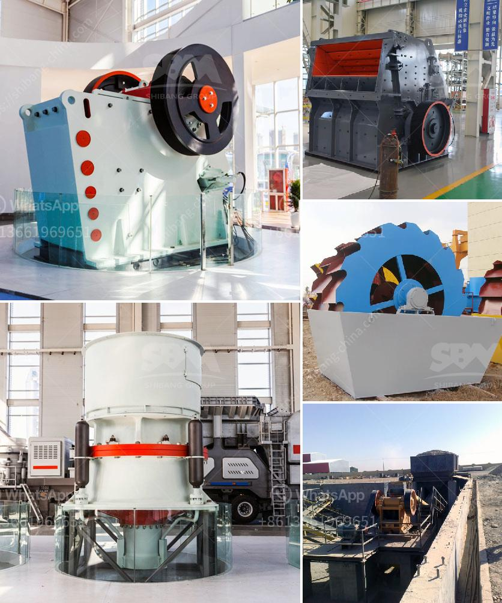

<h3>calcium processing plant</h3>
Calcium is an essential mineral that plays a vital role in various industries, agriculture, and human health. With increasing global demand, the establishment of a calcium processing plant holds immense benefits for both the economy and the well-being of communities. This article delves into the significance of calcium processing plants and highlights the advantages they offer.

   The construction and operation of a calcium processing plant create numerous job opportunities in both skilled and unskilled sectors. From engineers and technicians to transport workers and administrative staff, the plant's workforce contributes to local economic growth.

   Calcium processing plants drive revenue by producing a wide range of calcium-based products for commercial use. These can include calcium carbonate, calcium oxide, calcium hydroxide, and many others. The revenue generated from the sale of these products can significantly contribute to regional economic development.

   Calcium carbonate, one of the primary products derived from calcium processing plants, finds extensive usage in the construction industry. It is a key ingredient in the production of cement and concrete, providing strength, durability, and stability to structures.

   Calcium oxide, also known as quicklime, is a vital component used in the production of various chemicals. It is used as a pH regulator in water treatment, a desiccant in the production of rubber, and as a catalyst in the synthesis of numerous organic compounds.

   Calcium-based products are essential for maintaining soil fertility and enhancing crop yield. Calcium carbonate acts as a soil conditioner, improving nutrient absorption and pH balance. Furthermore, calcium hydroxide is used in the production of fertilizers, pesticides, and animal feed additives.

   Calcium is well-known for its role in bone development and maintenance. Adequate dietary intake of calcium can help prevent osteoporosis, a condition characterized by weakened bones. The availability of calcium products from processing plants ensures the availability of this critical mineral for human health.

   Calcium plays a crucial role in dental health, contributing to the strength and integrity of teeth. Calcium processing plant products, such as calcium carbonate, are used in the production of toothpaste, providing consumers with the necessary minerals for proper dental care.

   Calcium processing plants can utilize carbon capture and utilization technologies to reduce greenhouse gas emissions. By capturing carbon dioxide (CO2) emissions, the plant can convert it into useful products such as calcium carbonate, thus promoting sustainable and eco-friendly practices.

   Calcium processing plants can efficiently utilize waste products, such as limestone or marble dust, as raw materials. This reduces overall waste production and promotes a circular economy approach, resulting in less environmental impact.

The establishment of a calcium processing plant stands as a beacon of economic growth, offering employment opportunities and revenue generation. Its contributions to industries such as construction, agriculture, and healthcare are indispensable. Moreover, by embracing sustainable practices and mitigating environmental impact, such plants can significantly contribute to a greener and healthier future for all.
<h3>Contact us</h3><ul><li><strong>Whatsapp:&nbsp;<a href="https://wa.me/8613661969651">+8613661969651</a></strong></li><li><a href="https://swt.shibang-china.com/?git&amp;zhl&amp;calcium processing plant"><strong>Online Service(chat now)</strong></a></li></ul><h3>Related</h3><ul><li><a href='equipment for mineral ore mining industry.md'>equipment for mineral ore mining industry</a></li><li><a href='difference between pebble and rock.md'>difference between pebble and rock</a></li><li><a href='stone crusher plant kyc.md'>stone crusher plant kyc</a></li><li><a href='crusher on rent basis in nigeria.md'>crusher on rent basis in nigeria</a></li><li><a href='ball mill capacity of tons.md'>ball mill capacity of tons</a></li></ul>