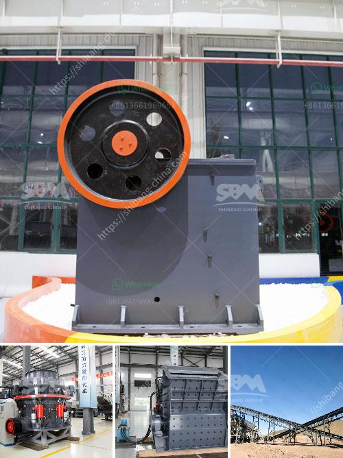

<h3>calcium roller mill</h3>
In the world of industrial milling, calcium carbonate (CaCO3) is a widely used compound. It is commonly found in rocks, shells of marine organisms, and even pearls. CaCO3 possesses diverse applications, ranging from construction materials like cement and mortar to pharmaceuticals and food additives. One of the key processes in calcium carbonate production is grinding, which involves the reduction of particle size for various applications. The advent of calcium roller mills has revolutionized this process, ensuring enhanced efficiency and quality of the final product.

A calcium roller mill is a specialized piece of equipment used for grinding and reducing the size of calcium carbonate particles. It utilizes multiple rollers spinning in opposite directions to achieve the desired fineness. The main advantage of using a roller mill over conventional grinding methods lies in its ability to produce a highly uniform particle size distribution. This is crucial for industries that rely on calcium carbonate, as it directly affects the performance and characteristics of the end products.

The roller mill operates on the principle of compression and shearing between the rollers and the material being fed into the machine. As the calcium carbonate is fed into the rollers, it is subjected to high pressure and mechanical force, resulting in the reduction of particle size. The rollers are specifically designed to ensure uniform grinding, preventing the creation of oversized or undersized particles. This consistency ultimately enhances the quality of the final product.

Another advantage of the calcium roller mill is its ability to handle a wide range of feed materials. It can process both dry and wet calcium carbonate, making it suitable for various industrial applications. Additionally, it can accommodate different feed sizes, ensuring flexibility in the production process. The roller mill can grind particles into sizes ranging from microns to a few millimeters, depending on the manufacturing requirements.

The use of a roller mill in calcium carbonate production also offers significant energy savings. The grinding process requires a substantial amount of energy, and conventional methods such as ball milling or hammer milling consume more power due to their lower efficiency. In contrast, a roller mill can achieve the same level of grinding with a lower energy input. This not only reduces costs but also contributes to a more sustainable manufacturing process.

Furthermore, calcium roller mills can be equipped with various auxiliary equipment to further improve productivity and product quality. Features such as particle classifiers and control systems allow for precise control and optimization of the grinding process. Additional components like air separators can remove unwanted impurities, ensuring a purer and higher-grade calcium carbonate product.

In conclusion, the calcium roller mill has revolutionized the process of grinding calcium carbonate particles. Its ability to produce a highly uniform particle size distribution, handle different feed materials, and achieve energy savings make it an indispensable tool in various industries. With the ability to enhance productivity and product quality, calcium roller mills have become the go-to solution for calcium carbonate manufacturers worldwide.
<h3>Contact us</h3><ul><li><strong>Whatsapp:&nbsp;<a href="https://wa.me/8613661969651">+8613661969651</a></strong></li><li><a href="https://swt.shibang-china.com/?git&amp;zhl&amp;calcium roller mill"><strong>Online Service(chat now)</strong></a></li></ul><h3>Related</h3><ul><li><a href='calcium carbonate for ball mill.md'>calcium carbonate for ball mill</a></li><li><a href='calcium carbonate plants in china.md'>calcium carbonate plants in china</a></li><li><a href='lime plant manufacturer in turkey.md'>lime plant manufacturer in turkey</a></li><li><a href='marble grinding machine price.md'>marble grinding machine price</a></li><li><a href='prices of stone crushers.md'>prices of stone crushers</a></li></ul>