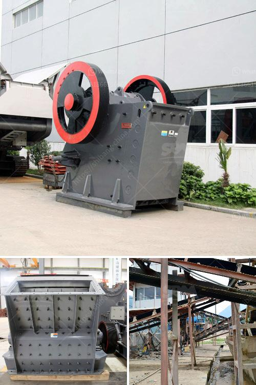

<h3>capital cost for iron ore pellet plant in india</h3>
Iron ore is an essential raw material for the manufacturing of steel, which plays a crucial role in various industries such as construction, automotive, and infrastructure. In India, the demand for steel has been steadily increasing due to rapid urbanization and the government's focus on infrastructure development. To meet this growing demand, iron ore pellet plants are being set up.

Setting up an iron ore pellet plant requires significant capital investment due to the extensive machinery, equipment, and infrastructure required. The initial capital cost for such a plant primarily includes the cost of land, construction of the plant, machinery, and equipment, as well as installation and commissioning expenses.

In India, the capital cost of setting up an iron ore pellet plant can range from 100 to 300 million dollars. The exact cost depends on the size of the plant and various other factors such as location and availability of resources. Large-scale pellet plants with a capacity above one million tons per annum generally have higher capital costs compared to smaller plants.

Apart from the initial capital investment, ongoing operational costs such as raw material procurement, labor, energy, and maintenance also need to be considered. These costs can fluctuate based on global iron ore prices, availability of skilled manpower, energy tariffs, and infrastructure support.

The capital cost for an iron ore pellet plant in India is high but can be justified by the long-term profits and growth opportunities it offers. India has abundant reserves of iron ore, making it an ideal location for pellet plant investments. Additionally, the growing demand for steel and government initiatives to boost the manufacturing sector make such investments even more attractive.

Investors looking for opportunities in the steel sector can explore the potential of setting up iron ore pellet plants in India. However, thorough feasibility studies and market analysis should be conducted to assess the profitability and viability of such projects, considering the significant capital costs involved.
<h3>Contact us</h3><ul><li><strong>Whatsapp:&nbsp;<a href="https://wa.me/8613661969651">+8613661969651</a></strong></li><li><a href="https://swt.shibang-china.com/?git&amp;zhl&amp;capital cost for iron ore pellet plant in india"><strong>Online Service(chat now)</strong></a></li></ul><h3>Related</h3><ul><li><a href='suppliers of mining equipment in south africa.md'>suppliers of mining equipment in south africa</a></li><li><a href='cement plant cost estimation.md'>cement plant cost estimation</a></li><li><a href='used coal washing plant sale.md'>used coal washing plant sale</a></li><li><a href='100tpd cement plant in india.md'>100tpd cement plant in india</a></li><li><a href='2d model ball mill.md'>2d model ball mill</a></li></ul>