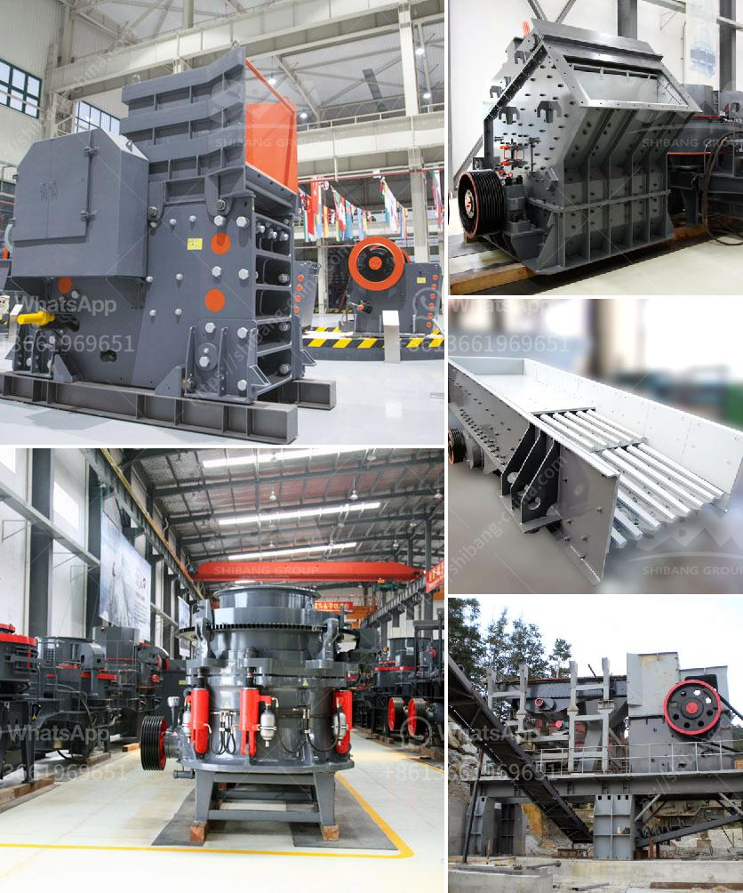

<h3>caterpillar impact crusher</h3>
The caterpillar impact crusher, also known as a track-mounted impact crusher, is widely used in many industries due to its versatile and efficient design. In this article, we will talk about the features and benefits of the caterpillar impact crusher, as well as its applications in various fields.

Firstly, let's take a closer look at the structure of the caterpillar impact crusher. It is equipped with a heavy-duty rotor and high wear-resistant blow bars for enhanced performance. The crusher's crushing chamber is large enough to handle a wide range of materials, including concrete, rubble, asphalt, and stone. This makes it suitable for various applications such as recycling, demolition, and quarrying.

One of the key features of the caterpillar impact crusher is its mobility. Being a track-mounted machine, it can easily move around any job site without requiring additional transportation. This eliminates the need for multiple machines and reduces the overall cost of the project. Moreover, the caterpillar impact crusher can access even the most challenging terrains, including steep slopes and rough surfaces, thanks to its excellent maneuverability and powerful engine.

The caterpillar impact crusher offers several benefits, making it a popular choice among contractors and operators. Firstly, it provides high productivity and efficiency. With its powerful crushing capability, it can process a large amount of material at a rapid rate, reducing the time and effort required for the job. This results in increased productivity and faster project completion.

Secondly, the caterpillar impact crusher is highly reliable and durable. Built with sturdy materials and a robust design, it can withstand the harshest conditions and heavy-duty applications. This reduces the downtime and maintenance costs, resulting in higher profitability for the user.

Another advantage of the caterpillar impact crusher is its excellent versatility. It can be used for a wide range of applications, from primary crushing to secondary and tertiary crushing. This flexibility allows operators to customize their operation according to the specific requirements of their projects.

The caterpillar impact crusher finds its applications in various fields. In the construction industry, it is widely used for crushing and recycling construction waste, including concrete debris, asphalt, and bricks. This not only helps in reducing landfill space but also contributes to environmental sustainability.

In the mining industry, the caterpillar impact crusher is utilized for crushing minerals and ores, including coal, iron ore, and limestone. Its powerful crushing capability enables efficient size reduction, allowing operators to extract valuable materials from the mined rocks and minerals.

Overall, the caterpillar impact crusher is a reliable and efficient machine that offers numerous benefits to its users. With its mobility, robustness, and versatility, it proves to be a valuable asset in various industries. Whether it is for recycling, demolition, quarrying, or mining, this machine can deliver superior performance and contribute to the success of any project.
<h3>Contact us</h3><ul><li><strong>Whatsapp:&nbsp;<a href="https://wa.me/8613661969651">+8613661969651</a></strong></li><li><a href="https://swt.shibang-china.com/?git&amp;zhl&amp;caterpillar impact crusher"><strong>Online Service(chat now)</strong></a></li></ul><h3>Related</h3><ul><li><a href='nigeria grinding mill.md'>nigeria grinding mill</a></li><li><a href='hammer grinding machine philippines.md'>hammer grinding machine philippines</a></li><li><a href='double roller crusher supplier.md'>double roller crusher supplier</a></li><li><a href='stone crusher design.md'>stone crusher design</a></li><li><a href='bauxite from cement plants in india.md'>bauxite from cement plants in india</a></li></ul>