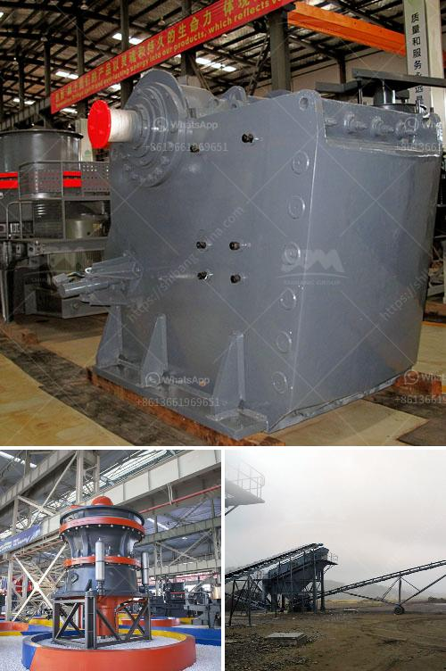

<h3>cconveyor belts class</h3>
Conveyor belts have become a crucial component in various industries due to their exceptional efficiency in moving items from one place to another. They have proven to be an indispensable tool, revolutionizing the way goods are transported. Whether it is in a manufacturing plant, airport, or distribution center, conveyor belts play a significant role in enhancing productivity and minimizing manual labor.

The concept of conveyor belts can be traced back to the late 18th century when they were first used in coal mines to ease the load on workers. Over time, their design and technology have evolved immensely, making them a vital asset in modern-day industries. From simple rubber belts to complex automated systems, conveyor belts have come a long way.

One fundamental aspect of conveyor belts is their classification based on the material being transported. Conveyor belts class refers to the categorization of belts according to their suitable applications. These classes are determined by factors like the weight, size, and shape of the items being moved. Here, we will explore three common conveyor belt classes and their typical applications.

1. General-Purpose Class: This class of conveyor belts is designed for transporting a wide range of materials, making them versatile and widely used. They are made of durable materials like rubber or PVC and can handle light to moderate loads. General-purpose conveyor belts are commonly found in grocery stores, warehouses, and small-scale manufacturing units. They are best suited for transporting items such as packaged goods, boxes, and loose materials.

2. Heavy-Duty Class: As the name suggests, this class of conveyor belts is specifically engineered to handle heavy loads and rugged environments. Heavy-duty conveyor belts are used in industries like mining, construction, and steel manufacturing, where moving bulky and abrasive materials is a regular occurrence. These belts are reinforced with strong materials like steel cords or special fabric layers to withstand the demanding conditions, ensuring long-lasting and reliable operation.

3. Food-Grade Class: Industries involved in food production and processing require conveyor belts that meet strict hygiene and safety standards. Food-grade conveyor belts are designed to transport food products without compromising their quality and integrity. They are made from materials that are resistant to oil, bacteria, and other contaminants. Additionally, they are easy to clean, preventing any cross-contamination and maintaining optimum sanitation levels. Food-grade conveyor belts are extensively used in bakeries, meat processing plants, and beverage industries.

It is vital to choose the appropriate conveyor belt class based on the specific requirements of an industry. The right conveyor belt ensures smooth operations, prevents damage to goods, and reduces downtime due to maintenance issues. Additionally, investing in high-quality conveyor belts improves overall efficiency, saving time and resources in the long run.

In conclusion, conveyor belts have revolutionized the way goods are transported in various industries, streamlining processes and enhancing productivity. The classification of conveyor belts allows industries to choose the most suitable type for their specific needs. Whether it is the general-purpose class for everyday use, heavy-duty class for demanding environments, or food-grade class for hygienic applications – each conveyor belt class plays a vital role in ensuring goods reach their destination efficiently and safely.
<h3>Contact us</h3><ul><li><strong>Whatsapp:&nbsp;<a href="https://wa.me/8613661969651">+8613661969651</a></strong></li><li><a href="https://swt.shibang-china.com/?git&amp;zhl&amp;cconveyor belts class"><strong>Online Service(chat now)</strong></a></li></ul><h3>Related</h3><ul><li><a href='clay graphite grinding process.md'>clay graphite grinding process</a></li><li><a href='japan used crushers.md'>japan used crushers</a></li><li><a href='mobile crusher machine manufacturer.md'>mobile crusher machine manufacturer</a></li><li><a href='jaw crusher 30 x 12.md'>jaw crusher 30 x 12</a></li><li><a href='jaw crusher principle in the refractory.md'>jaw crusher principle in the refractory</a></li></ul>