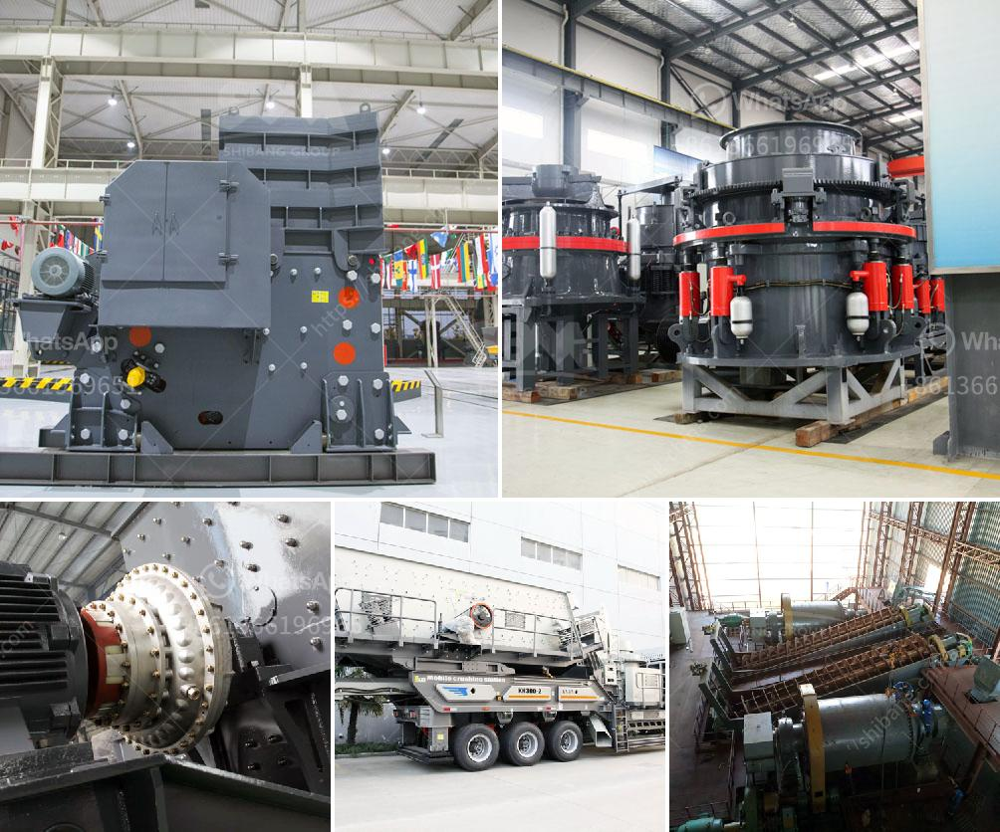

<h3>cement ball mills charging</h3>
Cement ball mills are commonly used in the production of cement and are a key component in the cement manufacturing process. Cement ball mills are devices that pulverize materials by grinding them into powder. The main components of cement ball mills include feeding part, discharging part, rotating part, and transmission part (reducer, small transmission gear, motor, and electric control). 

The process of charging cement ball mills starts by introducing the raw materials into the mill’s feed chute. The feed chute is typically equipped with a conveyor belt to transport the materials to the grinding chamber. The grinding process begins as the materials are cascaded or dropped into the grinding chamber, where they are impacted and ground by the grinding media – usually steel balls or cylpebs. 

The proper charging of cement ball mills is essential to optimize the grinding efficiency and ensure the best possible result. It is crucial to consider factors such as the ball charge distribution, the liner design, and the mill speed to ensure the proper cascading of the grinding media, which can enhance the grinding process and significantly reduce energy consumption.

A successful charge of cement ball mill requires a well-graded ball charge consisting of various sizes of grinding media, ranging from large balls to small cylpebs. The gradual addition of the grinding media helps establish and maintain the desired ball charge distribution. This distribution is critical to achieve the optimal impact and grinding action of the media within the mill, resulting in the desired particle size reduction.

Furthermore, the liners within the mill play a crucial role in the charging process. They protect the mill shell from excessive wear and also help control the location and motion of the grinding media. Proper liner design can assist in achieving the desired impact and grinding action, leading to improved efficiency and reduced power consumption.

In conclusion, charging cement ball mills is a critical process that affects the grinding efficiency, the energy consumption, and ultimately the quality of the final product. A well-designed and properly charged mill can improve overall grinding performance and lead to cost savings. Therefore, it is important to understand the principles behind cement ball mills charging and to carefully consider the ball charge distribution and liner design to optimize the grinding process.
<h3>Contact us</h3><ul><li><strong>Whatsapp:&nbsp;<a href="https://wa.me/8613661969651">+8613661969651</a></strong></li><li><a href="https://swt.shibang-china.com/?git&amp;zhl&amp;cement ball mills charging"><strong>Online Service(chat now)</strong></a></li></ul><h3>Related</h3><ul><li><a href='used coal washing plant sale.md'>used coal washing plant sale</a></li><li><a href='calcium carbonate for ball mill.md'>calcium carbonate for ball mill</a></li><li><a href='crusher plant in india.md'>crusher plant in india</a></li><li><a href='crusher cost stone crusher peru cost.md'>crusher cost stone crusher peru cost</a></li><li><a href='limestone washing and classifi ion.md'>limestone washing and classifi ion</a></li></ul>