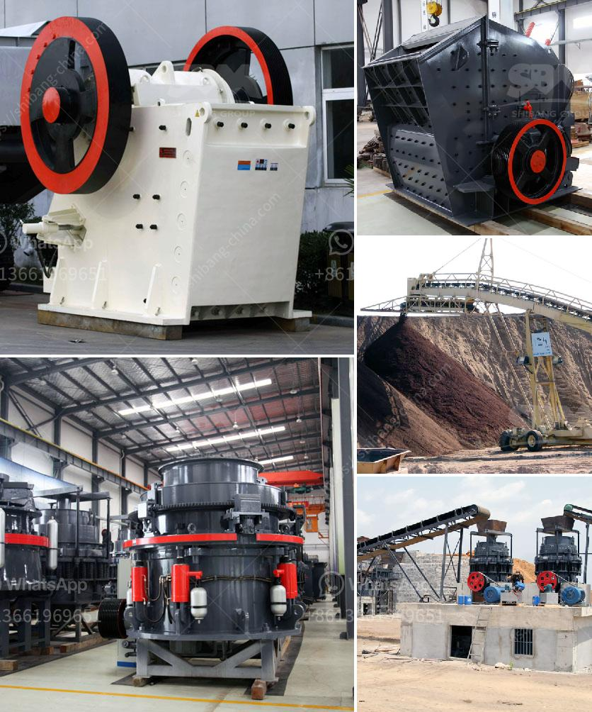

<h3>cement factory for sale in andra pradesh</h3>
With India's booming construction industry and increasing demand for cement, investing in a cement factory holds enormous potential for growth and profitability. The state of Andhra Pradesh, renowned for its infrastructure development and skilled workforce, presents a lucrative opportunity for entrepreneurs looking to enter the cement manufacturing sector. Let us explore the various aspects of a cement factory for sale in Andhra Pradesh.

Andhra Pradesh offers abundant limestone reserves, essential for cement production, making it an ideal destination for setting up a cement manufacturing unit. The state is well-connected with major cities and has a robust transportation infrastructure, providing easy access to raw materials and distribution channels. This strategic advantage ensures cost-effective operations and prompt delivery to the market.

The state government of Andhra Pradesh is actively promoting infrastructure development, including the construction of highways, airports, ports, and smart cities. As a result, the demand for cement has witnessed substantial growth, creating an unprecedented market potential for cement manufacturing companies. Acquiring an existing cement factory presents an excellent opportunity for investors to capitalize on this current upswing and contribute to the state's development.

Andhra Pradesh is known for its highly skilled and trained workforce, particularly in the construction and manufacturing sectors. With ample availability of skilled labor, entrepreneurs planning to acquire a cement factory in the state can benefit from a proficient and dedicated workforce. This advantage ensures streamlined operations, higher productivity, and better quality control, enhancing the overall competitiveness and profitability of the business.

The state government of Andhra Pradesh is proactively creating investor-friendly policies and offering attractive incentives to encourage industrial growth. Investors can avail attractive tax benefits, subsidies, and ease of doing business initiatives, streamlining the process of setting up and running a cement manufacturing unit. Such proactive measures facilitate a hassle-free business environment, reducing bureaucratic hurdles and promoting successful operations.

Acquiring a cement factory for sale in Andhra Pradesh presents a promising business opportunity amidst the region's infrastructural growth and increasing demand for cement. The prime location, availability of raw materials, skilled workforce, and regulatory support make it an ideal investment destination. Entrepreneurs willing to tap into the immense potential of the cement manufacturing sector can reap significant rewards in this dynamic and rapidly expanding market.
<h3>Contact us</h3><ul><li><strong>Whatsapp:&nbsp;<a href="https://wa.me/8613661969651">+8613661969651</a></strong></li><li><a href="https://swt.shibang-china.com/?git&amp;zhl&amp;cement factory for sale in andra pradesh"><strong>Online Service(chat now)</strong></a></li></ul><h3>Related</h3><ul><li><a href='how to start a concrete block business.md'>how to start a concrete block business</a></li><li><a href='clay graphite grinding process.md'>clay graphite grinding process</a></li><li><a href='cement process making in ashaka.md'>cement process making in ashaka</a></li><li><a href='crushing of gold mining dust.md'>crushing of gold mining dust</a></li><li><a href='aggregate for cement block making.md'>aggregate for cement block making</a></li></ul>