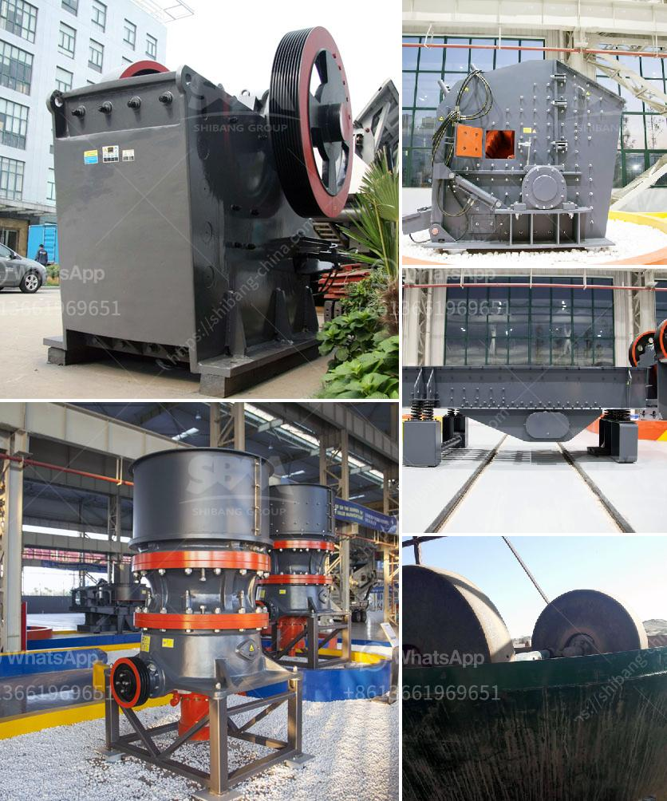

<h3>cement grinding unit 100 tpd total</h3>
A cement grinding unit, commonly known as a Clinker Grinding Unit (CGU), is an essential part of the cement manufacturing process. Cement is produced by grinding clinker (a mixture of cement plants' raw materials such as limestone, clay, and iron ore) in a ball mill. The industry typically requires different types of cement grinding units for different purposes, such as standalone clinker grinding units or integrated grinding and cement blending units.

A cement grinding unit with a capacity of 100 TPD (tons per day) is quite small compared to large-scale cement plants. However, with advancements in technology, smaller grinding units are now available that can cater to specific grinding requirements. These units are compact and portable, enabling flexibility in plant layout and offering cost-effective solutions.

The grinding process involves reducing clinker to a fine powder, often with the addition of gypsum to control setting time and improve cement properties. The grinding unit operates continuously, typically grinding Cement produced by clinker grinding units has better hydraulic properties and enhanced strength compared to cement produced in other processes.

To set up a cement grinding unit, several factors need to be considered. First and foremost is the availability of raw materials and their quality. Cement plants usually prefer to set up grinding units close to the source of raw materials to reduce transportation costs.

Another critical factor is the power supply. Grinding units require a significant amount of electricity, and uninterrupted power is necessary for continuous operation. Therefore, selecting a location with a reliable power supply is crucial.

Environmental factors, such as pollution control measures, waste disposal, and sustainability practices, should also be considered while setting up a cement grinding unit. Using modern technology and adopting eco-friendly practices can significantly reduce the environmental impact of the unit.

In conclusion, a cement grinding unit with a capacity of 100 TPD is a crucial part of the cement manufacturing process. It serves the purpose of reducing clinker to a fine powder and producing high-quality cement. With the advancements in technology, smaller grinding units are gaining popularity due to their flexibility and cost-effectiveness. However, several factors such as raw material availability, power supply, and environmental considerations need to be carefully evaluated before setting up a grinding unit.
<h3>Contact us</h3><ul><li><strong>Whatsapp:&nbsp;<a href="https://wa.me/8613661969651">+8613661969651</a></strong></li><li><a href="https://swt.shibang-china.com/?git&amp;zhl&amp;cement grinding unit 100 tpd total"><strong>Online Service(chat now)</strong></a></li></ul><h3>Related</h3><ul><li><a href='cement vertical mill tph kenya.md'>cement vertical mill tph kenya</a></li><li><a href='stone quarry crusher equipment.md'>stone quarry crusher equipment</a></li><li><a href='germany standard pyrophyllite powder grinding mill.md'>germany standard pyrophyllite powder grinding mill</a></li><li><a href='iron ore mines equipments.md'>iron ore mines equipments</a></li><li><a href='raymond mills usa.md'>raymond mills usa</a></li></ul>