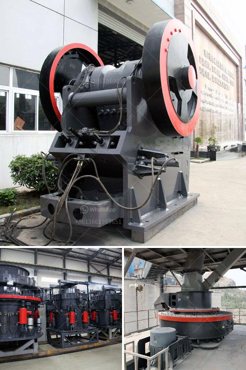

<h3>cement mill motor for sale uk</h3>
When it comes to the construction industry, cement plays a vital role. It is the most widely used building material and is essential for the development of infrastructure, such as buildings, bridges, dams, and roads. Behind the scenes, cement mills are responsible for grinding the clinker to produce the final product. This demanding task requires a reliable and robust motor, making the cement mill motor a critical component in cement production.

In the UK, the cement industry has been growing steadily, driving the demand for advanced machinery and equipment. As technologies evolve, the need for more efficient motors becomes imperative to enhance productivity and reduce energy consumption. Thankfully, cement mill motors for sale in the UK offer a solution.

Newer generations of cement mill motors integrate cutting-edge technologies that enable better performance and environmental sustainability. For instance, high-efficiency motors have become increasingly popular due to their ability to minimize energy loss and reduce greenhouse gas emissions. These motors are designed with improved insulation materials and optimized windings, allowing them to operate at higher power without overheating. As a result, they offer significant energy savings, contributing to a lower carbon footprint and lowering operating costs.

Furthermore, cement mill motors for sale in the UK also incorporate variable speed drive (VSD) technology. VSDs enable a motor's speed to be adjusted according to the specific requirements of the grinding process. By avoiding constant speed operation, VSDs help optimize energy consumption, reduce mechanical stress, and increase the overall lifespan of the motor. With the ability to adapt to varying loads, VSDs enhance operational flexibility, enabling the mill to operate at the most efficient point, whatever the production demands.

In recent years, there has been a growing focus on sustainability and environmental responsibility within the construction industry. Investments in energy-efficient cement mill motors align with these goals by advancing sustainable manufacturing practices. By upgrading to more efficient motors, cement manufacturers can contribute to a greener future.

To meet the increasing demand for cement mill motors, reputable suppliers in the UK offer a wide range of options to cater to different mill sizes and grinding requirements. These suppliers provide motors that comply with the latest industry standards, ensuring reliable and safe operation. They also offer comprehensive support, including maintenance services, spare parts availability, and technical expertise, ensuring uninterrupted productivity and optimum performance.

When considering a cement mill motor for sale in the UK, it is essential to evaluate factors like power consumption, operational efficiency, and environmental impact. It is recommended to select a motor that is compatible with the specific requirements of the cement mill and offers energy-saving features. Additionally, sourcing from trusted suppliers is crucial to ensure the quality and reliability of the motor.

In conclusion, the cement mill motor plays a crucial role in the production process, making it a vital component for the construction industry. With technological advancements, cement mill motors for sale in the UK have become more efficient, offering significant energy savings and contributing to sustainability efforts. By investing in these advanced motors, cement manufacturers can enhance their operations, reduce costs, and promote environmental responsibility.
<h3>Contact us</h3><ul><li><strong>Whatsapp:&nbsp;<a href="https://wa.me/8613661969651">+8613661969651</a></strong></li><li><a href="https://swt.shibang-china.com/?git&amp;zhl&amp;cement mill motor for sale uk"><strong>Online Service(chat now)</strong></a></li></ul><h3>Related</h3><ul><li><a href='lum vertical mill.md'>lum vertical mill</a></li><li><a href='stone crusher owners of khurda.md'>stone crusher owners of khurda</a></li><li><a href='germany standard pyrophyllite powder grinding mill.md'>germany standard pyrophyllite powder grinding mill</a></li><li><a href='barite beneficiation plant.md'>barite beneficiation plant</a></li><li><a href='thailand about stone crusher plant.md'>thailand about stone crusher plant</a></li></ul>