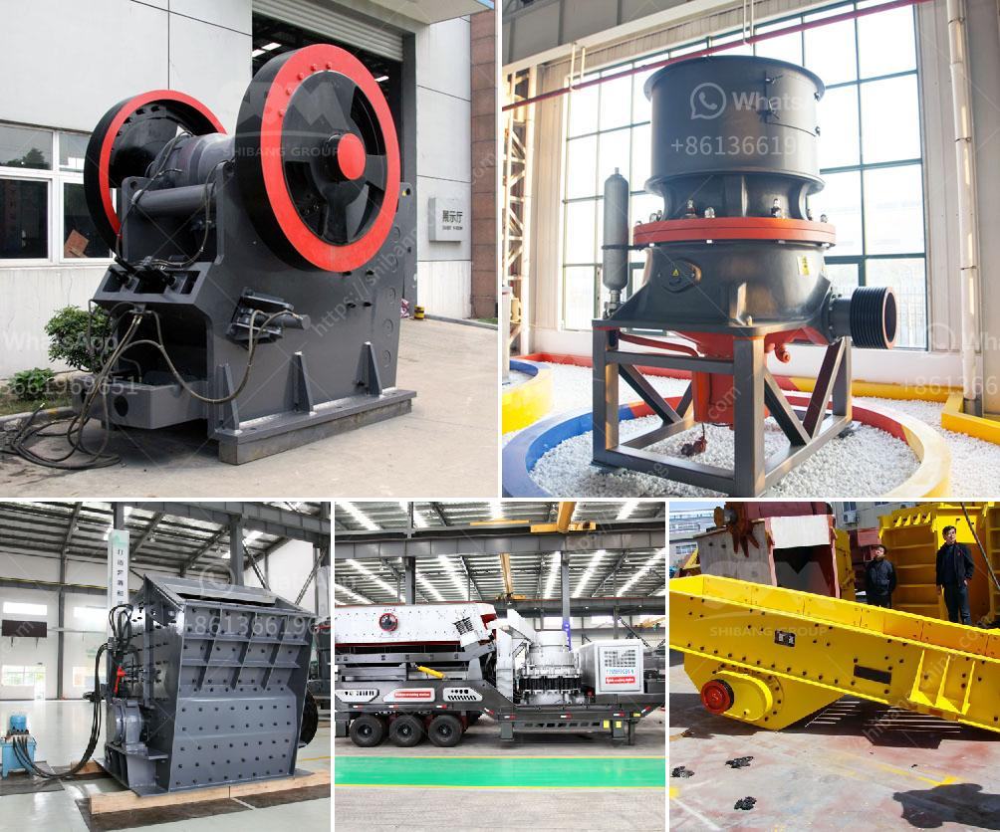

<h3>cement mill startup procedures</h3>
Starting a cement mill can be a complex and challenging task for any individual or team. It involves a series of steps and considerations to ensure a successful and efficient operation. This article will outline some essential startup procedures for a cement mill, providing valuable insights for those embarking on this venture.

1. Pre-Startup Planning: Before commencing the startup process, it is crucial to engage in thorough pre-startup planning. This includes evaluating the market demand for cement, understanding the competition, and analyzing potential risks and rewards associated with the venture. Adequate planning will help identify the required resources, such as manpower, machinery, and raw materials, ensuring a smooth startup process.

2. Acquire Permits and Compliance: It is essential to acquire all necessary permits and ensure compliance with local laws and regulations. This includes obtaining environmental permits, safety certifications, and adhering to quality control standards. Compliance with legal requirements is crucial to avoid legal entanglements and penalties that may hinder the success of the cement mill startup.

3. Procurement and Installation of Machinery: The next step involves procuring and installing the necessary machinery and equipment for cement production. This includes sourcing cement mills, crushers, kilns, and other essential machinery required for the manufacturing process. It is important to ensure that the machinery is of high quality and meets industry standards. Proper installation and calibration play a crucial role in the operational efficiency of the cement mill.

4. Engage Skilled Workforce: A skilled and competent workforce is vital to the success of any cement mill startup. This includes hiring experienced engineers, operators, technicians, and maintenance personnel. Providing proper training and onboarding these employees will ensure smooth operations and minimize risks associated with inexperience.

5. Test Run and Commissioning: Before beginning full-scale production, it is crucial to conduct a test run to identify any potential issues or malfunctions. This involves checking the machinery's performance, assessing energy consumption, and analyzing the quality of cement produced. Any necessary adjustments and fine-tuning should be made during this phase to optimize the mill's performance.

6. Production Start: Once the test run is successful, the cement mill can proceed to full-scale production. Monitoring the production process closely and implementing quality control measures are crucial during this phase. Adequate measures for waste management, safety, and environmental protection should be in place.

In conclusion, starting a cement mill requires careful planning, compliance with regulations, acquiring the necessary machinery, and assembling a skilled workforce. Following the outlined startup procedures will help ensure a successful and efficient operation. With the right planning and execution, a cement mill can become a profitable venture in the construction industry.
<h3>Contact us</h3><ul><li><strong>Whatsapp:&nbsp;<a href="https://wa.me/8613661969651">+8613661969651</a></strong></li><li><a href="https://swt.shibang-china.com/?git&amp;zhl&amp;cement mill startup procedures"><strong>Online Service(chat now)</strong></a></li></ul><h3>Related</h3><ul><li><a href='dolomite powder making equipment.md'>dolomite powder making equipment</a></li><li><a href='philippines mining equipment companies.md'>philippines mining equipment companies</a></li><li><a href='quartz stone crusher manufacturing machines.md'>quartz stone crusher manufacturing machines</a></li><li><a href='construction hammer mill.md'>construction hammer mill</a></li><li><a href='small mobile diesel engine double rolls crusher.md'>small mobile diesel engine double rolls crusher</a></li></ul>