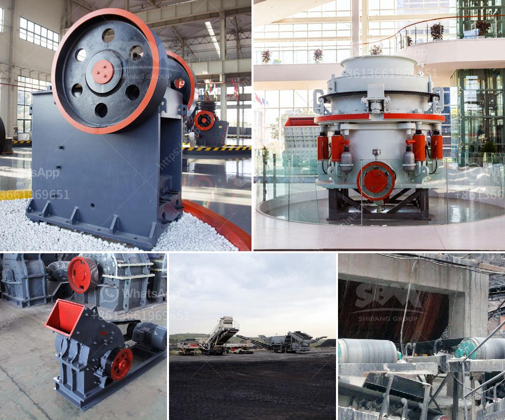

<h3>cement plant cost estimation</h3>
Building a cement plant is a challenging task. It requires extensive planning, careful consideration of various factors, and most importantly, accurate cost estimation. The cost estimation process plays a crucial role in determining the viability of the project, attracting potential investors, and ensuring the project stays within budget. In this article, we delve into the various elements that are taken into account when estimating the cost of setting up a cement plant.

One of the primary considerations in cost estimation is the size of the cement plant. The scale of the plant directly impacts the overall cost. A smaller plant will require less investment, equipment, and labor, resulting in lower costs. Conversely, a larger plant will require more resources and infrastructure, leading to higher expenses. Therefore, it is essential to carefully assess the required capacity and market demand before determining the plant size and estimating the associated costs.

Another critical factor in cost estimation is the technology used in the cement plant. Older technologies may be less expensive, but they could also be less efficient and more harmful to the environment. Newer, more advanced technologies, although pricier, offer increased productivity, energy efficiency, and reduced environmental impact. Evaluating the available technologies and their long-term benefits is crucial in accurately estimating the cost of a cement plant.

Site selection is another crucial consideration. The land required for a cement plant should not only accommodate the plant itself but also allow for potential expansion, storage areas, and transportation infrastructure. The availability and proximity of raw materials, such as limestone and clay, also factor into the site selection process. Additionally, the cost for land acquisition, site preparation, and necessary infrastructure development should be included in the overall cost estimation.

The cost of equipment and machinery is a significant component of the cement plant's budget. It includes the cost of crushers, kiln systems, mills, and other processing equipment. The selection of high-quality, reliable equipment is important to ensure the smooth operation of the plant and prevent costly breakdowns or downtime. Proper maintenance and spare parts also need to be factored into the cost estimation to ensure the plant remains operational in the long run.

Labor costs are another significant consideration. Skilled workers and operators are essential for efficient cement production. Estimating the number of workers required and their associated salaries, benefits, and training costs is crucial for accurate cost estimation. Another aspect to consider is the availability of skilled labor in the chosen location, as it may impact labor costs and hiring processes.

Various auxiliary facilities, such as power supply, water sources, waste disposal systems, and transportation infrastructure, should also be considered when estimating costs. These facilities play a vital role in maintaining the continuous operation of the cement plant. The cost of utilities, permits, licenses, and compliance with environmental regulations should be incorporated into the cost estimation.

In conclusion, accurate cost estimation is a fundamental aspect of establishing a cement plant. It involves carefully considering factors such as plant size, technology, site selection, equipment costs, labor expenses, and auxiliary facilities. A comprehensive cost estimation not only provides an insight into the financial feasibility of the project but also attracts potential investors by showcasing the thoroughness of the planning process. Therefore, investing time and effort into accurate cost estimation is essential for the successful execution of a cement plant project.
<h3>Contact us</h3><ul><li><strong>Whatsapp:&nbsp;<a href="https://wa.me/8613661969651">+8613661969651</a></strong></li><li><a href="https://swt.shibang-china.com/?git&amp;zhl&amp;cement plant cost estimation"><strong>Online Service(chat now)</strong></a></li></ul><h3>Related</h3><ul><li><a href='stone crusher plate specifiion pdf sat.md'>stone crusher plate specifiion pdf sat</a></li><li><a href='pf series impact crusher.md'>pf series impact crusher</a></li><li><a href='stone crusher machine for sale in ethiopia.md'>stone crusher machine for sale in ethiopia</a></li><li><a href='stone crushers for sale china.md'>stone crushers for sale china</a></li><li><a href='mobile concrete crusher trailer mounted.md'>mobile concrete crusher trailer mounted</a></li></ul>