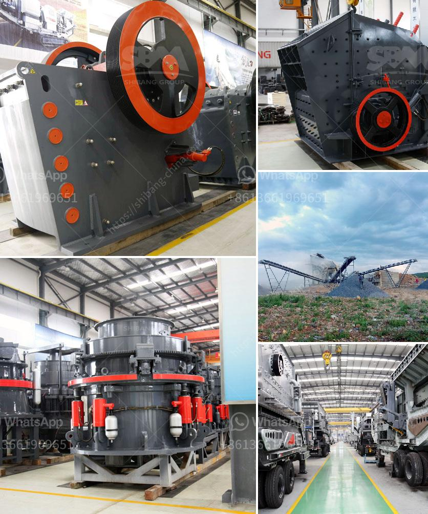

<h3>cement plant limestone crusher details</h3>
Cement is an essential material in the construction industry. It is used primarily to make concrete, mortar, and grout. Limestone, a sedimentary rock, is the primary component of cement as it provides the necessary calcium oxide for the production of cement.

To extract limestone from the mountainside, the raw material is first blasted in the quarry. The limestone blocks are then transported to a nearby crushing plant where they are crushed into smaller sizes. Limestone crushers, also called rock crushers, are used in the cement and mining industries to crush large rocks into smaller pieces.

The crushers consist of two rotating cylindrical shells that are horizontally mounted on a steel frame. In the crusher, the limestone is broken down by the hammers of a high-speed rotating rotor. The particles are then crushed against the inner surface of the breaker plate until they are small enough to pass through the lower gap between the rotor and breaker plate, where they are discharged.

The limestone crusher used in a cement plant usually has a production capacity of 50-1000 tons per hour. These types of crushers are designed to be reliable, durable, and efficient. Impact crushers, in particular, are widely used in cement factories to crush and grind limestone, coal, and other brittle materials.

To ensure smooth operation and increased uptime, regular maintenance and inspection of the limestone crusher are essential. This includes checking the oil levels, inspecting the wear parts, and addressing any issues promptly. Additionally, the crusher should be properly lubricated and the belts, gears, and bearings should be well-maintained.

In conclusion, the limestone crusher is a crucial piece of equipment in the cement plant. It helps ensure smooth operations and a high level of productivity. It is important to regularly inspect and maintain this equipment to ensure it remains in good working order and serves its purpose effectively. By doing so, the cement plant can continue to produce high-quality cement for the construction industry.
<h3>Contact us</h3><ul><li><strong>Whatsapp:&nbsp;<a href="https://wa.me/8613661969651">+8613661969651</a></strong></li><li><a href="https://swt.shibang-china.com/?git&amp;zhl&amp;cement plant limestone crusher details"><strong>Online Service(chat now)</strong></a></li></ul><h3>Related</h3><ul><li><a href='how to pulverized limestone crusher.md'>how to pulverized limestone crusher</a></li><li><a href='ball mill zenit crusher china.md'>ball mill zenit crusher china</a></li><li><a href='alluvial gold mining equipment used for sale.md'>alluvial gold mining equipment used for sale</a></li><li><a href='mobile gypsum crusher.md'>mobile gypsum crusher</a></li><li><a href='ykn vibrating screen manufacturer.md'>ykn vibrating screen manufacturer</a></li></ul>