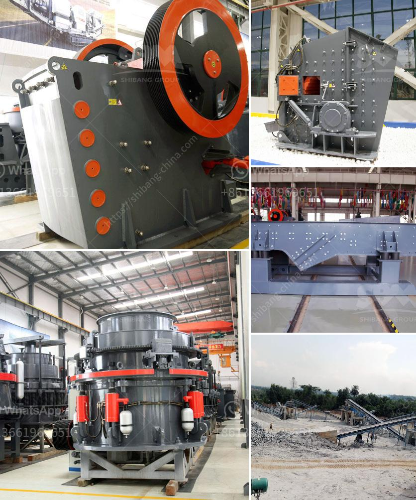

<h3>cement plants capacities of lafarge in nigeria</h3>
Lafarge is a multinational company that specializes in building materials, including cement production. In Nigeria, Lafarge has established several cement plants with impressive capacities, contributing significantly to the country's infrastructure development.

One of Lafarge's cement plants in Nigeria is located in Ewekoro, Ogun State. This plant has a capacity of producing 2.5 million metric tons of cement per annum. With such a large capacity, this plant plays a crucial role in meeting the growing demand for cement in Nigeria. Additionally, it signifies Lafarge's commitment to supporting the country's economic growth and development.

Another cement plant owned by Lafarge in Nigeria is situated in Ashaka, Gombe State. This plant boasts a capacity of producing 1 million metric tons of cement each year. Similar to the Ewekoro plant, the Ashaka plant is strategically located to cater to the demand for cement in the northern part of Nigeria. It has been instrumental in the construction and development of infrastructure in the region.

Lafarge's cement plants in Nigeria have consistently demonstrated excellence in production and quality control. These plants adhere to strict environmental and safety standards while employing advanced technology to ensure efficient and sustainable operations. Moreover, Lafarge places great emphasis on continuous improvement and innovation, continuously investing in research and development to enhance its cement production processes.

The significant capacities of Lafarge's cement plants in Nigeria have undoubtedly played a pivotal role in meeting the country's cement demands. They have contributed to the construction of various infrastructure projects, including roads, bridges, buildings, and residential areas. Lafarge's commitment to sustainable practices and quality production has earned the trust and loyalty of its customers and stakeholders.

As Nigeria continues to experience rapid urbanization and infrastructural development, the capacities of Lafarge's cement plants will play an essential role in ensuring a steady supply of cement. By investing in expanding its production capacities and adopting innovative technologies, Lafarge is poised to continue supporting Nigeria's growth trajectory and contributing to the country's economic development.
<h3>Contact us</h3><ul><li><strong>Whatsapp:&nbsp;<a href="https://wa.me/8613661969651">+8613661969651</a></strong></li><li><a href="https://swt.shibang-china.com/?git&amp;zhl&amp;cement plants capacities of lafarge in nigeria"><strong>Online Service(chat now)</strong></a></li></ul><h3>Related</h3><ul><li><a href='cconveyor belts class.md'>cconveyor belts class</a></li><li><a href='stone crusher finding.md'>stone crusher finding</a></li><li><a href='ballast crusher for sale.md'>ballast crusher for sale</a></li><li><a href='quarry machines for sale in kenya.md'>quarry machines for sale in kenya</a></li><li><a href='sand production project cost in india.md'>sand production project cost in india</a></li></ul>