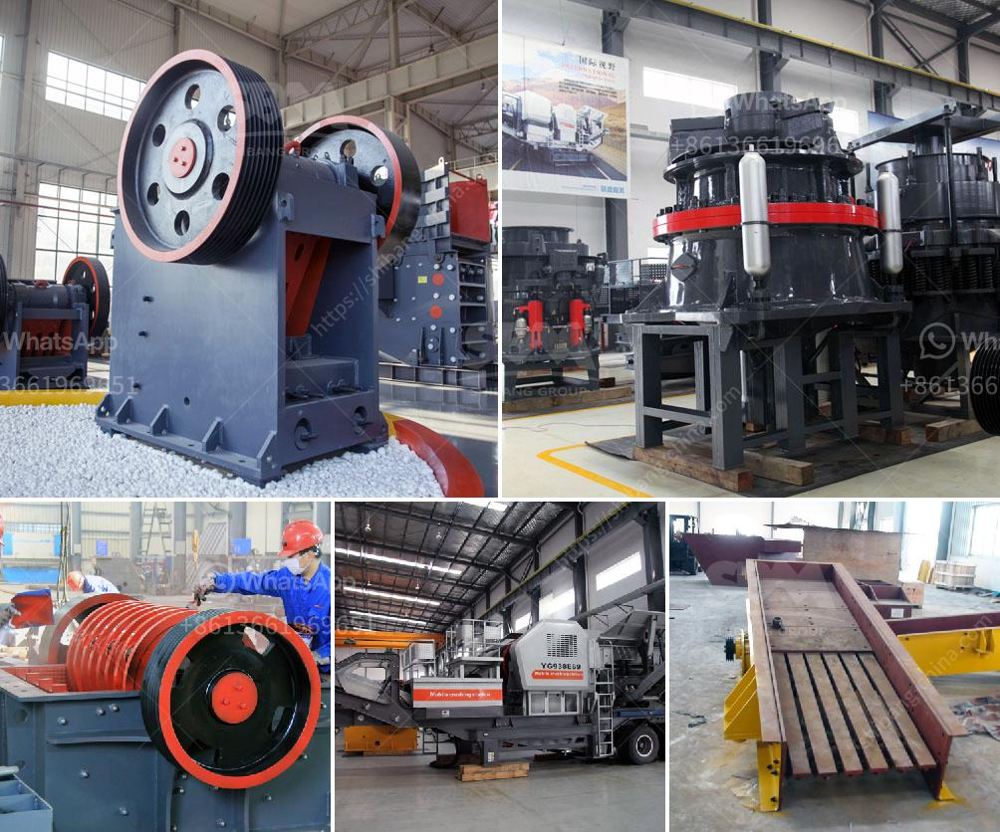

<h3>cement process making in ashaka</h3>
The Cement process in Ashaka, Nigeria, is a fascinating and intricate operation that plays a crucial role in the construction industry. Ashaka Cement is a subsidiary of Lafarge Africa Plc and has been at the forefront of cement production in the country for decades. With its state-of-the-art machinery, highly skilled workforce, and strict quality control measures, the company ensures the production of high-quality cement that meets both local and international standards.

The process of cement making in Ashaka begins with the extraction of limestone, a key component of cement, from the quarry. The limestone is then transported to the crushing plant, where it is crushed into smaller pieces to facilitate further processing. This crushed limestone is mixed with other additives, such as iron ore and bauxite, to achieve the desired chemical composition and properties of the cement.

The next step is the raw material grinding, where the crushed limestone and additives are ground into a fine powder. This powder, known as raw meal, is then transported to the preheater tower, where it is heated to high temperatures to initiate chemical reactions that form clinker, the primary ingredient of cement.

After the clinker is formed, it is ground into a fine powder in a cement mill. This final product, known as cement, undergoes further quality control checks to ensure its consistency and standard compliance. The cement is then packed in bags or bulk and ready for distribution to various construction sites.

One of the key advantages of the cement-making process in Ashaka is its commitment to sustainability. The company utilizes state-of-the-art technology that reduces energy consumption and minimizes emissions, contributing to a greener and cleaner environment. Additionally, Ashaka Cement prioritizes waste management, recycling, and reusing materials, further reducing its environmental impact.

In conclusion, the cement-making process in Ashaka involves a series of intricate steps that ensure the production of high-quality cement. With its commitment to sustainability and quality control measures, Ashaka Cement has established itself as a leading cement manufacturer in Nigeria, playing a crucial role in the country's construction industry.
<h3>Contact us</h3><ul><li><strong>Whatsapp:&nbsp;<a href="https://wa.me/8613661969651">+8613661969651</a></strong></li><li><a href="https://swt.shibang-china.com/?git&amp;zhl&amp;cement process making in ashaka"><strong>Online Service(chat now)</strong></a></li></ul><h3>Related</h3><ul><li><a href='silica sand mining equipment.md'>silica sand mining equipment</a></li><li><a href='stone crusher for hire in durban.md'>stone crusher for hire in durban</a></li><li><a href='portable mobile crusher for sale.md'>portable mobile crusher for sale</a></li><li><a href='the process of limestone.md'>the process of limestone</a></li><li><a href='vibrating feeder sinter oret.md'>vibrating feeder sinter oret</a></li></ul>