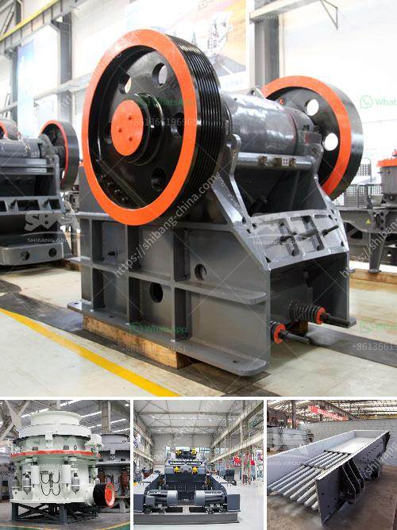

<h3>cement vertical mill tph kenya</h3>
In the rapidly evolving world of construction and infrastructure development, the demand for cement continues to rise. As countries strive to meet their ambitious sustainable development goals, the need for efficient and environmentally friendly cement production techniques becomes paramount. Cement vertical mills have emerged as a powerful solution to meet these objectives, offering numerous advantages over traditional horizontal mills. 

One such country that has embraced this technology is Kenya. With its booming construction sector, Kenya has witnessed an increasing demand for cement. To address this demand, many cement manufacturers are turning to cement vertical mills, which offer significant benefits in terms of energy efficiency, cost savings, and environmental sustainability.

A cement vertical mill is a specialized equipment used to grind cement clinker efficiently. By incorporating advanced grinding and separating technologies, it can produce high-quality cement with reduced energy consumption. Compared to traditional horizontal mills, vertical mills consume less electricity and require lower maintenance, resulting in cost savings for manufacturers.

Furthermore, cement vertical mills contribute to sustainability by reducing carbon emissions and minimizing environmental impact. Vertical mills typically have a smaller footprint compared to horizontal mills, enabling cement manufacturers to optimize their floor space and reduce the overall environmental footprint of their operations. Additionally, vertical mills produce less noise and dust, creating a safer and healthier work environment for employees.

In Kenya, the adoption of cement vertical mills has been rapidly increasing due to their numerous benefits. Many cement manufacturers have invested in upgrading their facilities to incorporate this advanced technology. By doing so, they are not only enhancing their operational efficiency but also contributing to the country's sustainable development goals.

The government of Kenya recognizes the importance of sustainable cement production and has implemented policies and regulations to encourage its adoption. Cement vertical mills align with these goals by reducing energy consumption, carbon emissions, and waste generation. By embracing these technologies, Kenya can achieve a more sustainable future and reduce its dependence on imported cement, promoting economic growth and job creation.

In conclusion, cement vertical mills offer a wide range of benefits to cement manufacturers in Kenya. These mills enhance efficiency, reduce costs, and contribute to environmental sustainability. As the construction and infrastructure sectors in Kenya continue to grow, the adoption of cement vertical mills will play a crucial role in meeting the increasing demand for high-quality and sustainable cement. By embracing this technology, Kenya can pave the way for a greener and more prosperous future.
<h3>Contact us</h3><ul><li><strong>Whatsapp:&nbsp;<a href="https://wa.me/8613661969651">+8613661969651</a></strong></li><li><a href="https://swt.shibang-china.com/?git&amp;zhl&amp;cement vertical mill tph kenya"><strong>Online Service(chat now)</strong></a></li></ul><h3>Related</h3><ul><li><a href='feldspar powder machine.md'>feldspar powder machine</a></li><li><a href='materials used in mining gold and diamond.md'>materials used in mining gold and diamond</a></li><li><a href='list of all the equipment for gold mining.md'>list of all the equipment for gold mining</a></li><li><a href='gravel crushers in saskatchewan for sale.md'>gravel crushers in saskatchewan for sale</a></li><li><a href='crusher equipment manufacturer.md'>crusher equipment manufacturer</a></li></ul>