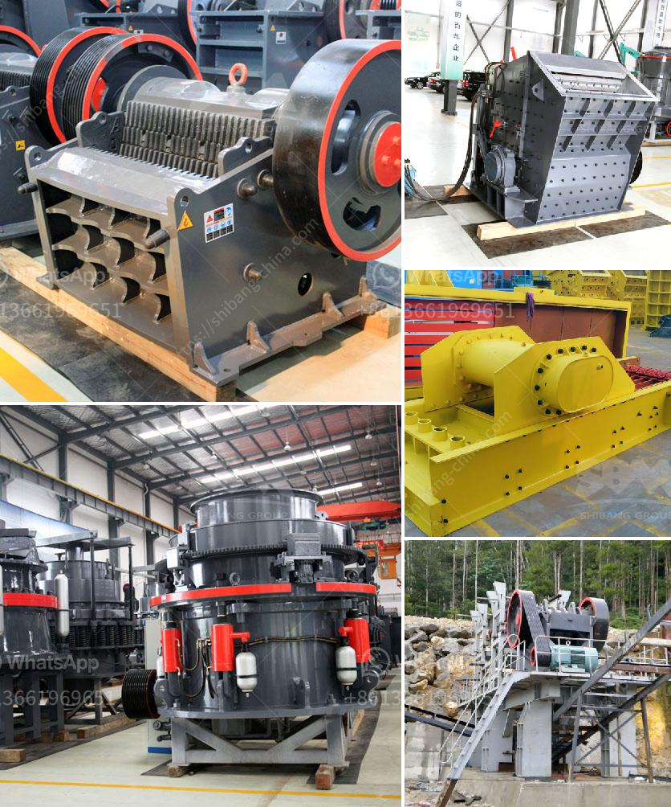

<h3>ceramic crushing production line</h3>
Ceramics are essential materials used in various industries, including construction, electronics, and healthcare. They provide excellent insulation, durability, and resistance to heat, chemicals, and wear. However, the manufacturing process for ceramics involves crushing materials into small particles, which requires sophisticated equipment and expertise.

A ceramic crushing production line is commonly used in industries such as ceramics, metallurgy, and mining. By employing efficient crushing machines, the line allows ceramics to be crushed at a higher rate, enhancing overall production efficiency. Moreover, as crushed ceramics have a wide range of applications, an efficient crushing production line ensures high-quality ceramic products.

The first key component of a ceramic crushing production line is a jaw crusher. This machine is used to crush ceramic materials into particles of desirable size. Jaw crushers consist of two jaws, one fixed and the other moving, pressuring the material against the fixed jaw and crushing it using mechanical force. Ceramics with larger sizes are broken down into smaller pieces, facilitating subsequent processing.

After the initial crushing stage, a secondary crusher is used to further refine the ceramic particles. Commonly, cone crushers or impact crushers are employed for this purpose. Cone crushers work by squeezing the material between an eccentrically rotating mantle and a concave, providing higher efficiency and finer particle sizes. On the other hand, impact crushers utilize powerful impact forces to crush ceramics, generating particles with better shape and uniformity.

To ensure continuous and consistent crushing, a vibrating screen is incorporated in the ceramic crushing production line. This screen separates the crushed ceramics into different sizes, allowing for targeted processing or use in various applications. The vibrating screen also removes impurities from the crushed material, enhancing the quality of the final ceramic products.

For large-scale ceramic production, a ball mill is often used to further pulverize the crushed ceramics into a fine powder. The ball mill applies mechanical forces to the ceramic particles, resulting in size reduction and homogenization. This fine powder can then be molded, shaped, or used as a raw material in other ceramic manufacturing processes.

An efficient ceramic crushing production line offers numerous benefits for manufacturers. Firstly, it significantly increases production capacity by enabling continuous and automated crushing processes. This reduces production downtime and labor costs, ensuring a higher output of ceramic materials. Moreover, the use of advanced crushing machines improves energy efficiency, resulting in cost savings and a reduced environmental impact.

Another advantage of an efficient ceramic crushing production line is the production of high-quality ceramic materials. The uniformity and consistency of the crushed ceramics ensure consistent results in subsequent processes, such as molding, firing, and glazing. This leads to higher-quality ceramic products that meet strict industry standards and customer expectations.

In conclusion, a ceramic crushing production line plays a vital role in enhancing efficiency and quality in the ceramic manufacturing industry. By utilizing jaw crushers, secondary crushers, vibrating screens, and ball mills, ceramics can be crushed, sorted, and refined effectively and continuously. This not only increases production capacity but also improves the quality of the final ceramic products. As the demand for high-performance ceramics grows, adopting an efficient crushing production line is crucial for manufacturers to stay competitive in the market.
<h3>Contact us</h3><ul><li><strong>Whatsapp:&nbsp;<a href="https://wa.me/8613661969651">+8613661969651</a></strong></li><li><a href="https://swt.shibang-china.com/?git&amp;zhl&amp;ceramic crushing production line"><strong>Online Service(chat now)</strong></a></li></ul><h3>Related</h3><ul><li><a href='china gold dry washer manufacturer in philippines.md'>china gold dry washer manufacturer in philippines</a></li><li><a href='want to buy stone crusher in canada.md'>want to buy stone crusher in canada</a></li><li><a href='mining quarry equipment for sale sri lanka.md'>mining quarry equipment for sale sri lanka</a></li><li><a href='small cement grinding plant.md'>small cement grinding plant</a></li><li><a href='iron crushing plant.md'>iron crushing plant</a></li></ul>