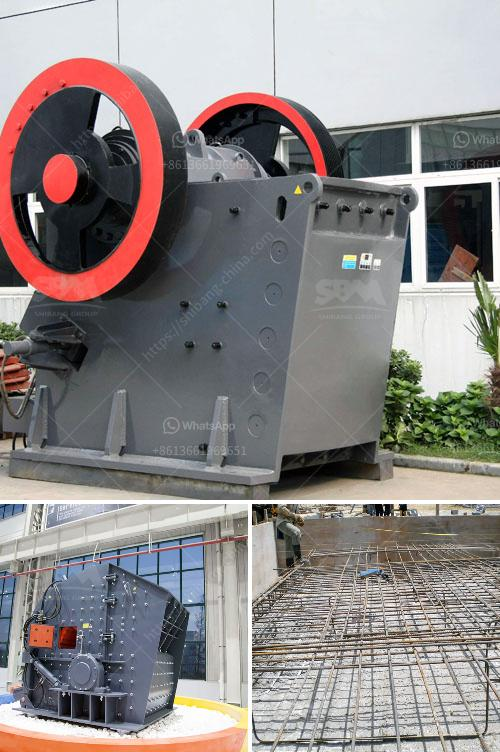

<h3>changing jaw on a crusher</h3>
Crushers play a crucial role in various industries, including mining, construction, and recycling. These robust machines are designed to reduce large rocks or debris into smaller, more manageable sizes. One critical component of a crusher is the jaw, which serves as its primary crushing mechanism. In this article, we will explore the importance of changing the jaw on a crusher and how it can significantly improve operational efficiency.

The jaw is responsible for breaking down the material fed into the crusher, ensuring consistent and efficient crushing. Over time, due to the abrasive nature of the processed material, the jaw's wear and tear become inevitable. Gradual deterioration of the jaw can lead to reduced productivity, increased downtime, and additional maintenance costs.

Changing the jaw on a crusher is a proactive maintenance practice recommended to ensure optimal crushing performance. It involves replacing the worn-out jaw with a new one to maintain stability, precision, and a continuous flow of the crushing process. Here's how the process of changing the jaw can significantly enhance crushing efficiency:

1. Improved crushing capacity: A new jaw with sharp teeth and optimal profiles will improve the crusher's ability to break down material effectively. It increases productivity by maintaining a consistent feed size and reducing the risk of clogging.

2. Enhanced reliability: Worn-out jaws are more prone to cracks and failures, which not only lead to safety hazards but also cause unexpected breakdowns. Installing a new jaw ensures greater reliability, minimizing the chances of unplanned downtime and improving overall equipment availability.

3. Cost-effective operation: Although it may seem counterintuitive, investing in changing the jaw on a crusher can lead to significant cost savings in the long run. Improved crushing efficiency reduces energy consumption, extends the crusher's lifespan, and mitigates repair and replacement costs for other critical components such as bearings and shafts.

4. Consistent product quality: A worn-out jaw often produces uneven and irregular-shaped crushed material, impacting the quality of the final product. A new jaw provides a uniform crushing force across the material, resulting in more consistent particle sizes, especially beneficial for industries that require precise material specifications.

a. Safety precautions: Ensuring proper lockout/tag-out procedures are followed to prevent accidental starting of the crusher during maintenance.

b. Jaw removal: Loosening the tensioning bolt or hydraulic cylinders that hold the jaw in place, allowing its removal.

c. Replacement: Installing the new jaw, ensuring proper alignment, and torqueing the tensioning bolts to the appropriate specifications.

d. Lubrication: Applying the recommended lubricants to the jaw bearings and other critical components to optimize performance and extend their lifespan.

Changing the jaw on a crusher is a crucial maintenance practice that enhances crushing efficiency, improves reliability, and ensures consistent product quality. By investing in regular jaw replacements, industries can optimize their crushing processes, reduce downtime, and ultimately increase profitability. Keeping a close eye on the jaw's wear indicators and implementing a proactive replacement strategy will yield long-term benefits for any operation relying on crushers for material processing.
<h3>Contact us</h3><ul><li><strong>Whatsapp:&nbsp;<a href="https://wa.me/8613661969651">+8613661969651</a></strong></li><li><a href="https://swt.shibang-china.com/?git&amp;zhl&amp;changing jaw on a crusher"><strong>Online Service(chat now)</strong></a></li></ul><h3>Related</h3><ul><li><a href='start m sand unit kerala cost.md'>start m sand unit kerala cost</a></li><li><a href='grinding garnet machine.md'>grinding garnet machine</a></li><li><a href='rock crushers in china.md'>rock crushers in china</a></li><li><a href='used cement crushers for sale.md'>used cement crushers for sale</a></li><li><a href='aluminum slag processing plant in germany.md'>aluminum slag processing plant in germany</a></li></ul>