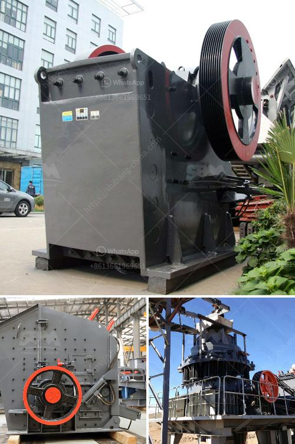

<h3>charcoal crusher kenya</h3>
Charcoal is a solid black substance made from carbonized wood or other organic materials. It is primarily used as a fuel for cooking and heating in many parts of the world, especially in Africa. In Kenya, charcoal production is a major contributor to deforestation and climate change. Large areas of forests are cut down to make way for charcoal production, leading to the loss of natural habitats for wildlife and exacerbating global warming.

To address this environmental issue, the Kenyan government and various organizations have been promoting sustainable charcoal production methods and alternative fuel sources. One such initiative is the use of charcoal crushers. These machines crush charcoal into small grains or particles that are then used for cooking and heating. The crushed charcoal is cleaner and has less dust, smoke, and pollutants than traditional charcoal.

The charcoal crusher is a unique equipment that is designed and manufactured according to the needs of the charcoal production industry. The equipment is mainly used for crushing charcoal samples into suitable size particles to make them have certain density and shape to meet the requirements of charcoal production. The crushed material is also easy for transportation and storage.

Charcoal production in Kenya mainly occurs in rural areas where farmers or individuals directly engage in charcoal production activities. The traditional production method involves cutting down trees, burning them in open-air pits, and then crushing the resulting charcoal by hand using hammers or wooden sticks. This process is not only time-consuming and labor-intensive but also extremely harmful to the environment.

With the introduction of charcoal crushers in Kenya, the production of charcoal has become more efficient and environmentally friendly. These machines not only help reduce manual labor but also enable the production of a consistent quality of charcoal. The use of charcoal crushers also helps limit the spread of fires during the production process, ensuring the safety of workers and surrounding communities.

Furthermore, the use of charcoal crushers reduces the residual ash content in charcoal, making it more appealing to consumers. It is worth noting that charcoal produced using crushers has a higher calorific value, meaning it provides more heat energy per kilogram. This makes it more desirable for cooking and heating purposes.

The adoption of charcoal crushers in Kenya has greatly contributed to the sustainable production of charcoal and the conservation of forests. By using these machines, farmers and individuals can extract value from waste biomass materials, such as agricultural residues, instead of cutting down trees for charcoal production. This not only reduces deforestation but also helps mitigate climate change.

In conclusion, the charcoal crusher in Kenya plays a crucial role in the sustainable production of charcoal, contributing to the protection of the environment and the conservation of forests. Its efficiency and effectiveness have revolutionized charcoal production, making it more profitable and environmentally friendly. With further promotion and support, the use of charcoal crushers has the potential to transform the charcoal production industry in Kenya and beyond.
<h3>Contact us</h3><ul><li><strong>Whatsapp:&nbsp;<a href="https://wa.me/8613661969651">+8613661969651</a></strong></li><li><a href="https://swt.shibang-china.com/?git&amp;zhl&amp;charcoal crusher kenya"><strong>Online Service(chat now)</strong></a></li></ul><h3>Related</h3><ul><li><a href='list of all the equipment for gold mining.md'>list of all the equipment for gold mining</a></li><li><a href='cement mill motor for sale uk.md'>cement mill motor for sale uk</a></li><li><a href='small motor ore crusher for home.md'>small motor ore crusher for home</a></li><li><a href='crusher plants for sale.md'>crusher plants for sale</a></li><li><a href='china jaw crusher pe 150 250 in philippines.md'>china jaw crusher pe 150 250 in philippines</a></li></ul>