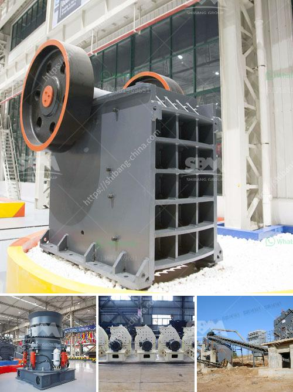

<h3>charcoal making machine south africa</h3>
In recent years, South Africa has witnessed a growing focus on sustainable practices and environmental conservation. As part of this movement, the country has seen a surge in the use of alternative energy sources, including charcoal. Traditional methods of charcoal production often lead to deforestation and contribute to pollution. However, with the advent of charcoal making machines, South Africa is now able to produce charcoal in a more sustainable and efficient manner.

One of the key advantages of using a charcoal making machine in South Africa is its ability to utilize agricultural and forestry waste as a raw material. This waste, which would otherwise be discarded or burnt, is converted into high-quality charcoal through a process known as carbonization. This not only reduces the environmental impact of waste disposal but also provides an additional source of income for farmers and rural communities.

Charcoal making machines in South Africa typically operate through a combination of heat and pressure. The raw material is heated within a sealed chamber, where it undergoes a series of chemical reactions that convert it into charcoal. The heat generated during this process is then used to sustain the carbonization, eliminating the need for additional fuel sources. This closed-loop system significantly reduces energy consumption and minimizes greenhouse gas emissions.

Moreover, the use of a charcoal making machine makes charcoal production in South Africa more cost-effective. Traditional methods require a vast amount of manpower and resources, making it an impractical and expensive venture. In contrast, charcoal making machines are automated and require minimal labor input. Once the machine is set up and running, it can produce charcoal continuously, maximizing efficiency and yield. This streamlining of the production process translates into lower costs for both producers and consumers.

Another benefit of utilizing charcoal making machines in South Africa is the production of high-quality charcoal. These machines ensure a consistent carbonization process, resulting in charcoal with high calorific value and low ash content. This makes the charcoal ideal for various applications, including cooking, heating, and industrial processes. The production of clean and efficient charcoal can significantly reduce South Africa's reliance on coal and fossil fuels, contributing to a more sustainable and greener energy sector.

Furthermore, the charcoal making machine industry in South Africa presents an opportunity for job creation and economic growth. As the demand for sustainable energy sources increases, so does the need for skilled technicians and operators to run and maintain these machines. This can lead to the creation of new jobs in rural areas, where the majority of agricultural and forestry waste is generated. Additionally, the production and export of charcoal can boost the local economy, increasing revenue and fostering economic development.

In conclusion, the introduction of charcoal making machines in South Africa offers a sustainable solution to traditional methods of charcoal production. By utilizing agricultural and forestry waste, these machines not only reduce environmental impact but also provide economic opportunities for rural communities. The cost-effectiveness, high-quality production, and potential for job creation make charcoal making machines an attractive investment in South Africa's journey towards a greener and more sustainable future.
<h3>Contact us</h3><ul><li><strong>Whatsapp:&nbsp;<a href="https://wa.me/8613661969651">+8613661969651</a></strong></li><li><a href="https://swt.shibang-china.com/?git&amp;zhl&amp;charcoal making machine south africa"><strong>Online Service(chat now)</strong></a></li></ul><h3>Related</h3><ul><li><a href='manufacture of vibrating screens.md'>manufacture of vibrating screens</a></li><li><a href='marble and granite grinder and crusher.md'>marble and granite grinder and crusher</a></li><li><a href='rock crusher machine malaysia.md'>rock crusher machine malaysia</a></li><li><a href='mtm 70 ball mill how much capacity.md'>mtm 70 ball mill how much capacity</a></li><li><a href='ball grinding machine in india.md'>ball grinding machine in india</a></li></ul>