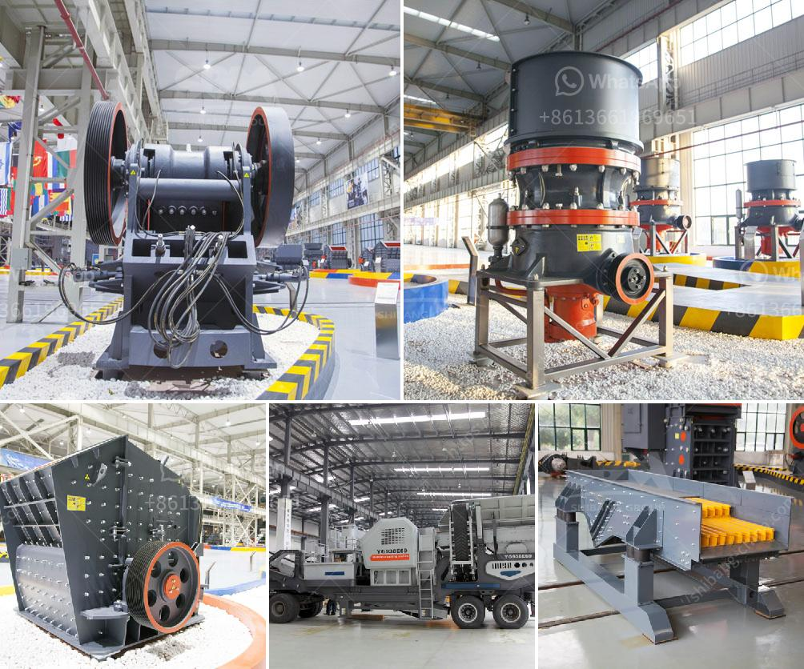

<h3>cheap stone crushing plant</h3>
Are you considering investing in a stone crushing plant, but unsure about which one to choose? With many options available in the market, it can be overwhelming to find the most suitable plant that fits within your budget. However, there is good news for those on a tight budget – cheap stone crushing plants can fulfill your requirements while being cost-effective.

A stone crushing plant is used to break down stones into different sizes for various applications. The primary purpose of this plant is to produce high-quality aggregate by crushing stones into a consistent shape and size. Crushing plants can be stationary or mobile, allowing for convenient relocation if necessary. Additionally, they can be operated by one person, reducing labor costs.

When searching for a cheap stone crushing plant, multiple factors need to be considered. Firstly, look for a reliable manufacturer or supplier that offers reasonable prices without compromising on quality. By doing some research and comparing prices from different sources, it is possible to find cost-effective options that meet your specific needs.

Another way to save money is to opt for a stationary crushing plant instead of a mobile one. Mobile plants often come with a higher price tag due to the added convenience and flexibility they offer. However, if your operations are mostly located in one place, a stationary plant can provide cost advantages by eliminating the need for frequent relocation.

Furthermore, consider the capacity required for your operations. By accurately estimating your production requirements, you can choose a stone crushing plant with adequate crushing capabilities, saving unnecessary expenses associated with excess capacity.

Lastly, it is crucial to evaluate the quality and durability of the plant. A cheap stone crushing plant that compromises on quality may result in frequent breakdowns and additional maintenance costs. Look for plants with a strong construction that can withstand harsh working conditions and have reliable components to ensure longevity.

In conclusion, finding a cheap stone crushing plant does not mean compromising on quality. By spending time researching different options, comparing prices, and evaluating the plant's capacity and durability, you can find a cost-effective solution that meets your operational requirements. Remember to choose a reliable manufacturer or supplier that offers reasonable prices without sacrificing the overall quality of the plant. Invest wisely to maximize the return on your investment and ensure a smooth and efficient stone crushing process.
<h3>Contact us</h3><ul><li><strong>Whatsapp:&nbsp;<a href="https://wa.me/8613661969651">+8613661969651</a></strong></li><li><a href="https://swt.shibang-china.com/?git&amp;zhl&amp;cheap stone crushing plant"><strong>Online Service(chat now)</strong></a></li></ul><h3>Related</h3><ul><li><a href='cost of vertical raw mill.md'>cost of vertical raw mill</a></li><li><a href='crusher plant in construction.md'>crusher plant in construction</a></li><li><a href='jaw crusher seller in pakistan.md'>jaw crusher seller in pakistan</a></li><li><a href='conveyor belt manufacturers in kolkata.md'>conveyor belt manufacturers in kolkata</a></li><li><a href='cinder block crushing machines for rent.md'>cinder block crushing machines for rent</a></li></ul>