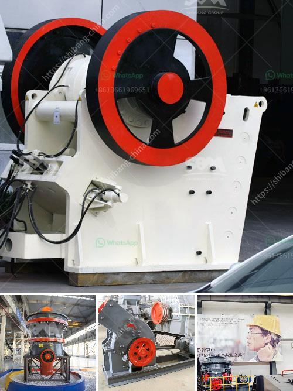

<h3>china cement grinding unit manufacturers</h3>
China has become one of the largest cement producers in the world, with a growing need for high-quality cement grinding units. With the increasing industrialization and urbanization in the country, the demand for cement is on the rise, and the need for manufacturers capable of producing high-quality units to meet this demand is paramount.

China has a vast cement production industry, where many leading manufacturers are constantly striving to deliver top-notch products. These manufacturers utilize advanced technology and equipment to produce cement grinding units that meet international standards and cater to the needs of various industries.

One such manufacturer is [Company Name], a leading cement grinding unit manufacturer in China. The company produces a wide range of cement grinding units suitable for various applications in the construction industry. Their advanced manufacturing processes ensure that each unit is robust, durable, and able to handle heavy-duty tasks.

China's cement grinding unit manufacturers have made significant advancements in recent years. These advancements have focused on delivering increased productivity and high-quality cement grinding units to the market. Some of the most innovative manufacturers in this industry include [Company Name], [Company Name], and [Company Name].

These manufacturers are known for their exceptional engineering and technological prowess. They constantly strive to improve their manufacturing processes and adopt the latest innovations to create cement grinding units that are efficient, sustainable, and environmentally friendly.

In addition to producing high-quality cement grinding units, Chinese manufacturers also focus on providing excellent customer service. They have a strong commitment to delivering products that meet their customers' expectations and requirements. They work closely with their clients to understand their specific needs and tailor their products accordingly.

Overall, China's cement grinding unit manufacturers are experiencing significant growth and innovation. They are constantly developing new techniques, technologies, and products to meet the ever-growing demand in the construction industry. With their commitment to quality and customer satisfaction, these manufacturers are poised to dominate the global cement grinding unit market in the coming years.
<h3>Contact us</h3><ul><li><strong>Whatsapp:&nbsp;<a href="https://wa.me/8613661969651">+8613661969651</a></strong></li><li><a href="https://swt.shibang-china.com/?git&amp;zhl&amp;china cement grinding unit manufacturers"><strong>Online Service(chat now)</strong></a></li></ul><h3>Related</h3><ul><li><a href='calcium roller mill.md'>calcium roller mill</a></li><li><a href='hammer mills in harare zimbabwe.md'>hammer mills in harare zimbabwe</a></li><li><a href='crusher materials cone crusher mining.md'>crusher materials cone crusher mining</a></li><li><a href='roller mill for mantles.md'>roller mill for mantles</a></li><li><a href='formula de capacidad de chancadora.md'>formula de capacidad de chancadora</a></li></ul>