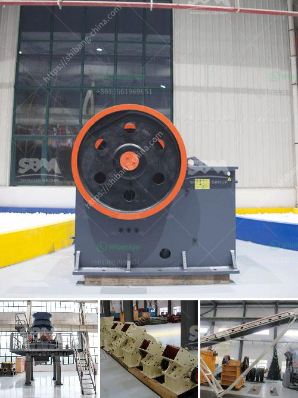

<h3>china clay grinding mill</h3>
China is a manufacturing powerhouse, known for its wide range of industries and production capacity. One such industry that has seen significant growth in recent years is the manufacturing of grinding mills, specifically the China clay grinding mill. With the ever-increasing demand for products made from China clay, the mill has become an essential tool for its processing.

China clay, also known as kaolin, is a kind of soft white clay that is predominantly found in China. It is used in various industries, including papermaking, ceramics, rubber, paint, and pharmaceuticals. China clay is widely used due to its unique properties, such as high plasticity, high electrical insulating properties, and low viscosity when mixed with water.

The emergence of the China clay grinding mill has greatly contributed to the processing of China clay to various industries. The grinding process is usually carried out in stages to achieve the desired particle size for applications such as paper coating, ceramic glazes, and paint production. The mill consists of different components, including a motor, grinding chamber, blades, and a discharge system.

One of the key advantages of the China clay grinding mill is its ability to produce a wide range of particle sizes. This flexibility is crucial in industries where different products require specific particle sizes for optimal performance. Moreover, the mill's design allows for precise control of the grinding process, resulting in consistent and high-quality output.

In addition to its particle size control, the China clay grinding mill also offers energy efficiency. The motor used in the mill is designed to minimize energy consumption while providing sufficient power for grinding. This energy-efficient design reduces operational costs and ensures sustainability.

Another notable feature of the China clay grinding mill is its ease of maintenance. The components are designed for easy access, allowing for quick inspection and servicing. This reduces downtime and increases overall productivity in the long run.

Furthermore, the China clay grinding mill is designed to meet strict safety standards. Safety features such as protective covers, emergency stop buttons, and automatic shutdown systems ensure the safety of operators and prevent accidents.

As the demand for China clay continues to grow, the development of the China clay grinding mill is expected to follow suit. Manufacturers are constantly striving to improve the mill's efficiency, productivity, and safety features to meet the evolving needs of industries.

In conclusion, the China clay grinding mill has revolutionized the processing of China clay, providing industries with a reliable and efficient tool. Its ability to produce a wide range of particle sizes, energy efficiency, ease of maintenance, and adherence to safety standards make it a valuable asset in various sectors. As China's manufacturing sector continues to expand, the China clay grinding mill will play a pivotal role in meeting the demands of the ever-growing market.
<h3>Contact us</h3><ul><li><strong>Whatsapp:&nbsp;<a href="https://wa.me/8613661969651">+8613661969651</a></strong></li><li><a href="https://swt.shibang-china.com/?git&amp;zhl&amp;china clay grinding mill"><strong>Online Service(chat now)</strong></a></li></ul><h3>Related</h3><ul><li><a href='part of ball mills.md'>part of ball mills</a></li><li><a href='kaolin dry beneficiation.md'>kaolin dry beneficiation</a></li><li><a href='cconveyor belts class.md'>cconveyor belts class</a></li><li><a href='manufacturing equipments of lime stone milling.md'>manufacturing equipments of lime stone milling</a></li><li><a href='slag quarry equipments supplies in algeria.md'>slag quarry equipments supplies in algeria</a></li></ul>